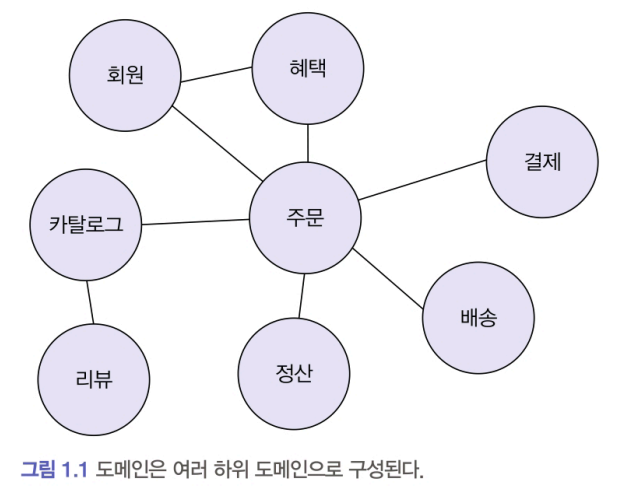
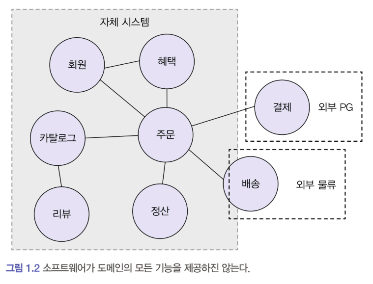

# 1-1. 도메인이란?

### 도메인
소프트웨어의 대상을 도메인이라고 말할 수 있다.   
**소프트웨어로 해결하고자 하는 문제 영역**이 도메인domain에 해당한다.

#### 예시(온라인 서점)
- 개발자 입장에서 온라인 서점은 구현해야 할 소프트웨어의 대상 
- 온라인 서점 소프트웨어는 온라인으로 책을 판매하는 데 필요한 상품 조회, 구매, 결제, 배송 추적 등의 기
능을 제공해야 한다. 
- 이때 온라인 서점은 한 도메인은 다시 하위 도메인으로 나눌 수 있다. 

도메인은 여러 하위 도메인으로 구성된다.  
그리고 하나의 하위 도메인은 다른 하위 도메인과 연동하여 완전한 기능을 제공한다. 

#### 예시(온라인 서점)
- 카탈로그 하위 도메인은 고객에게 구매할 수 있는 상품 목록을 제공하고, 주문 하위 도메인은 고객의 주문을 처리한다. 혜택 하위 도메인은 쿠폰이나 특별 할인과 같은 서비스를 제공하고, 배송 하위 도메인은 고객에게 구매한 상품을 전달하는 일련의 과정을 처리한다. 

특정 도메인을 위한 소프트웨어라도 도메인이 제공해야 할 모든 기능을 직접 구현하는 것은 아니다.  
경우에 따라 외부 시스템(third-party api)을 활용하는 방식을 채택할 수 있다. 
  

하위 도메인을 어떻게 구성할지 여부는 상황에 따라 달라진다. 

#### 예시(온라인 커머스)
- 기업 고객을 대상으로 대형 장비를 판매하는 곳은 온라인으로 카탈로그를 제공하고 주문서를 받는 정도만 필요할 것이다. 온라인 결제나 배송 추적과 같은 기능을 제공할 필요가 없다.
- 반면, 일반 고객을 대상으로 물건을 판매한다면 카탈로그, 리뷰, 주문, 결제, 배송, 회원 기능 등이 필요할 것이다.