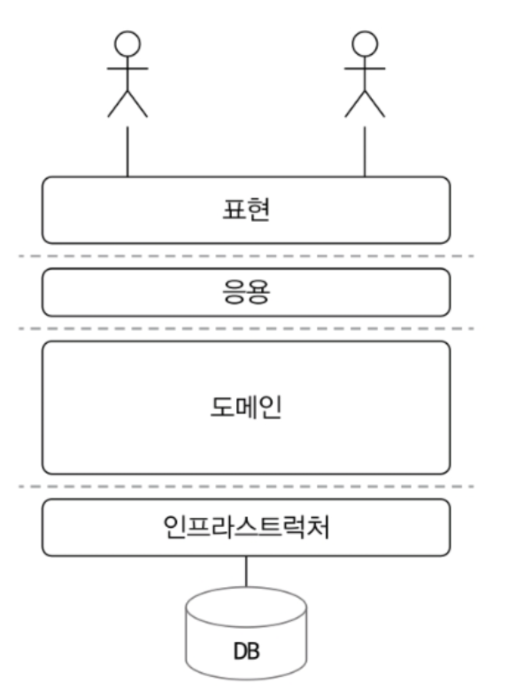

# 1-4.  도메인 모델 패턴

### 애플리케이션 아키텍쳐 구조


- Presentation (표현)
    - 사용자의 요청을 처리하고 사용자에게 정보를 보여준다.
    - 사용자는 소프트웨어를 사용하는 사람 뿐 아니라 외부 시스템일 수도 있다.

- Application (응용)
    - 사용자가 요청한 기능을 실행한다.
    - 업무 로직을 직접 구현하지 않으며, 도메인 계층을 조합해서 기능을 실행한다.

- **Domain**
    - 시스템이 제공할 도메인 규칙을 구현한다.

- Infrastructure
    - 데이터베이스나 메시징 시스템과 같은 외부 시스템과의 연동을 처리한다.


> 앞서 살펴본 도메인 모델이 `도메인` 자체를 이해하는 데 필요한 `개념 모델` 을 의미한다면,
> 여기서 살펴볼 도메인 모델은 [엔터프라이즈 애플리케이션 아키텍처 패턴 - 마틴 파울러](https://product.kyobobook.co.kr/detail/S000001766248)
> 의 도메인 모델 패턴을 의미한다.
> *도메인 모델 - 아키텍처 상의 도메인 계층을 객체 지향 기법으로 구현하는 패턴

도메인 계층은 도메인의 핵심 규칙을 구현한다.

예를 들어 주문 도메인의 경우,

- '출고 전에 배송지를 변경할 수 있다'
- '주문 취소는 배송 전에만 할 수 있다.'

위의 두 규칙을 구현한 코드가 도메인 계층에 위치하게 된다.

이런 도메인 규칙을 객체 지향 기법으로 구현하는 패턴이 도메인 모델 패턴이다.

```java
public class Order {
    private OrderState state;
    private ShippingInfo shippinginfo;

    public void changeShippingInfo(ShippingInfo newShippingInfo) {
        if (!state.isShippingChangeable()) {
            throw new IllegalStateException("can't change shipping in " + state);
        }
        this.shippinginfo = newShippingInfo;
    }
    
    // ...
}

//주문 상태를 표현 
public enum OrderState {
    PAYMENT_WAITING { //주문 대기 상태 (배송지 변경 가능)
        public boolean isShippingChangeable() {
            return true;
        }
    },
    PREPARING { // 상품 준비 중 상태 (배송지 변경 가능)
        public boolean isShippingChangeable() {
            return true;
        }
    },
    //default
    SHIPPED, DELIVERING, DELIVERY_COMPLETED;

	// 배송지를 변경할 수 있는지 검사 (default)
    public boolean isShippingChangeable() {
        return false;
    }
}
```

- OrderState
    - 주문 대기 중이거나 상품 준비 중에는 배송지를 변경할 수 있다는 도메인 규칙을 구현
- Order
    - 실제 배송지 정보를 변경하는 주체
    - `OrderStatus`의 `isShippingChangeable()` 를 활용해 변경 가능한 경우에만 배송지를 변경


`OrderState` 는 `Order` 에 속한 데이터이므로, 배송지 정보 변경 가능 여부를 판단하는 코드 `isShippingChangeable()` 를 `Order` 로 이동할 수도 있다.

```java
public class Order {
    private OrderState state;
    private ShippingInfo shippinginfo;

    public void changeShippingInfo(ShippingInfo newShippingInfo) {
        if (!state.isShippingChangeable()) {
            throw new IllegalStateException("can't change shipping in " + state);
        }
        this.shippinginfo = newShippingInfo;
    }
    
    private boolean isShippingChangeable() {
        return state == OrderState.PAYMENT_WAITING || 
	        state == OrderState.PREPARING;
    }    
    // ...
}

//상수만 제공
public enum OrderState {
    PAYMENT_WAITING ,
    PREPARING,
    SHIPPED, 
    DELIVERING, 
    DELIVERY_COMPLETED;
}

```

배송지 변경이 가능한지를 판단할 규칙이 주문 상태와 다른 정보를 함께 사용하는 경우, OrderState 만으로는 배송지 변경 가능 여부를 판단할 수 없으므로 Order에서 로직을 구현해야 한다.

배송지 변경 가능 여부를 판단하는 기능이 Order에 있든 OrderState에 있든 중요한 점은
`주문과 관련된 중요한 업무 규칙을 주문 도메인 모델에서 구현한다는 점`이다.

핵심 규칙을 구현한 코드는 `도메인 모델` 에만 위치하기 때문에, 규칙이 바뀌거나 규칙을 확장해야 할 때 다른 코드에 영향을 덜 주고 변경 내역을 모델에 반영할 수 있게 된다.

> 이 책에서 말하는 `도메인 모델` 개념적인 모델을 의미한다기 보다는, 도메인 계층을 구현할  때 사용하는 객체 모델을 의미한다.

### 개념 모델과 구현 모델

##### 개념 모델
- 순수하게 문제를 분석한 결과물
- 데이터 베이스, 트랜잭션 처리, 성능, 구현 기술과 같은 것을 고려하지 않는다.
- 실제 코드를 작성할 때 개념 모델을 있는 그대로 사용할 수 없다.
- 개념 모델을 구현 가능한 형태의 모델로 전환하는 과정을 거치게 된다.

처음 부터 완벽한 개념 모델을 만들기 보다는 초기엔 개요 수준의 개념 모델로 도메인의 전체 윤곽을 이해하는 데 집중하고, 구현 과정에서 개념 모델을 구현 모델로 점진적으로 발전시켜 나가야 한다.

| 항목    | 개념 모델                     | 구현 모델             |
| ----- | ------------------------- | ----------------- |
| 초점    | 도메인 이해                    | 기술 구현             |
| 독자    | 도메인 전문가, 기획자, 개발자         | 주로 개발자            |
| 문서 형태 | UML, 텍스트, 화이트보드 모델        | 코드, ERD, API 명세 등 |
