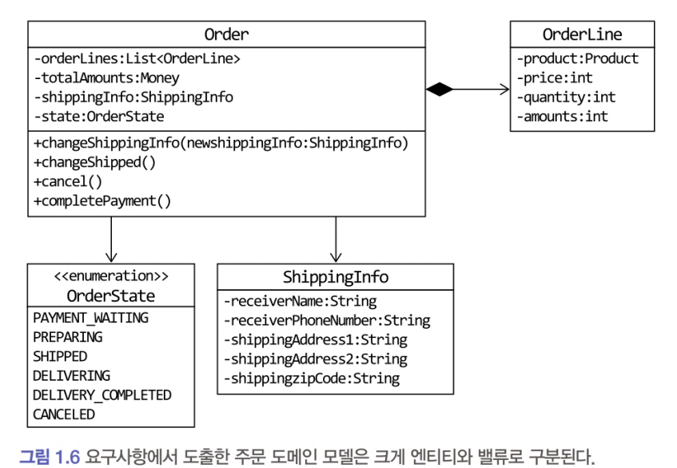
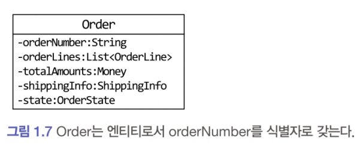

# 1.6 엔티티와 밸류

도출한 모델은 크게 엔티티Entity와 밸류Value로 구분할 수 있다.


## 1.6.1 엔티티
  

엔티티의 가장 큰 특징은 식별자를 가진다.  
식별자는 엔티티 객체마다 고유해서 각 엔티티는 서로 다른 식별자를 갖게 되며, 이 값은 바뀌지 않는다.  
엔티티를 생성하고 속성을 바꾸고 삭제할 때까지 식별자는 유지된다.  
엔티티의 식별자는 바뀌지 않고 고유하기 때문에 두 엔티티 객체의 식별자가 같으면 두 엔티티는 같다고 판단할 수 있다.  

#### 엔티티를 구현한 클래의 equals() 메서드의 hashCode() 메서드
```java
public class Order {
    
    private String orderNumber;
    
    @Override
    public boolean equals(Object obj) {
        if (this == obj) return true;
        if (obj== null) return false;
        if (obj.getClass() != Order.class) return false;
        Order other = (Order)obj;
        if (this.orderNumber == null) return false;
        return this.orderNumber.equals(other.orderNumber);
    }

    @Override
    public int hashCode() {
        final int prime = 31;
        int result = 1;
        result = prime * result + ((orderNumber == null) ? 0 : orderNumber.hashCode());
        // 필드가 더 있다면
        // result = 31 * result + field2.hashCode();
        return result;
    }
```
```java
result = 1;
result = 31 * result + a;  // -> 31 * 1 + a
result = 31 * result + b;  // -> 31 * (31 * 1 + a) + b = 31^2 + 31a + b

//hashCode = 31² * 1 + 31¹ * a + 31⁰ * b
```
#### 31?
- 소수(prime number) 사용으로 해시 분포를 넓고 고르게 할 수 있다. 충돌 가능성 낮춤
- 31 × x 는 (x << 5) - x로 계산 가능
    - 즉, x * 32 - x = x * 31
    - 옛날 JVM에서 특히 유리
    - 요즘은 JIT 컴파일러가 최적화를 다 해주므로, 이건 역사적인 이유

## 1.6.2 엔티티의 식별자 생성
엔티티의 식별자를 생성하는 시점은 도메인의 특징과 사용하는 기술에 따라 달라질 수 있다.  

#### 식별자의 생성 방식
- 특정 규칙에 따라 생성
- UUID 나 Nano ID 와 같은 고유 식별자 생성기 사용
- 값을 직접 입력
- 일련번호 사용 (시퀀스나 DB의 자동 증가 컬럼 사용)

주문번호, 운송장번호, 카드번호와 같은 식별자는 특정 규칙에 따라 생성한다.   
이 규칙은 도메인에 따라 다르고, 같은 주문번호라도 회사마다 다를 수 있다.  
- 예를 들어 두 온라인 서점의 주문번호는 각각  '20211128317280○○○'와 '001-A882770000'일 수 있다.

### 예
- 날짜와 시간을 이용해서 식별자를 생성할 수도 있다.
    - 주의할 점은 같은 시간에 동시에 식별자를 생성해도 같은 식별자가 만들어지면 안 된다는 것이다.  
- UUID(universally unique identifier)를 사용해서 식별자를 생성할 수 있다. 
    - 다수의 개발 언어가 UUID 생성기를 제공하므로 마땅한 규칙이 없다면 UUID를 식별자로 사용할 수 있다.
- 회원의 아이디나 이메일과 같은 식별자는 값을 직접 입력한다. 
    - 사용자가 직접 입력하는 값이기 때문에 식별자를 중복해서 입력하지 않도록 사전에 방지하는 것이 중요하다.
- 일련번호를 식별자로 사용하기도 한다. 일련번호 방식은 주로 데이터베이스가 제공하는 자동 증가 기능을 사용한다. 
    - 예를 들어 오라클을 사용한다면 시퀀스를 이용해서 자동 증가 식별자를 구하고 MySQL을 사용한다면 자동 증가 칼럼을 이용해서 일련번호 식별자를 생성한다.
    - 자동 증가 칼럼은 DB 테이블에 데이터를 삽입해야 비로소 값을 알 수 있기 때문에 테이블에 데이터를 추가하기 전에는 식별자를 알 수 없다. 
        - 엔티티 객체를 생성할 때 식별자를 전달할 수 없고, db에 엔티티를 저장한 뒤 식별자를 구해서 엔티티 객체에 반영하게 된다.
- 자동 증가 칼럼을 제외한 다른 방식은 다음과 같이 식별자를 먼저 만들고 엔티티 객체를 생성할 때 식별자를 전달한다.   
