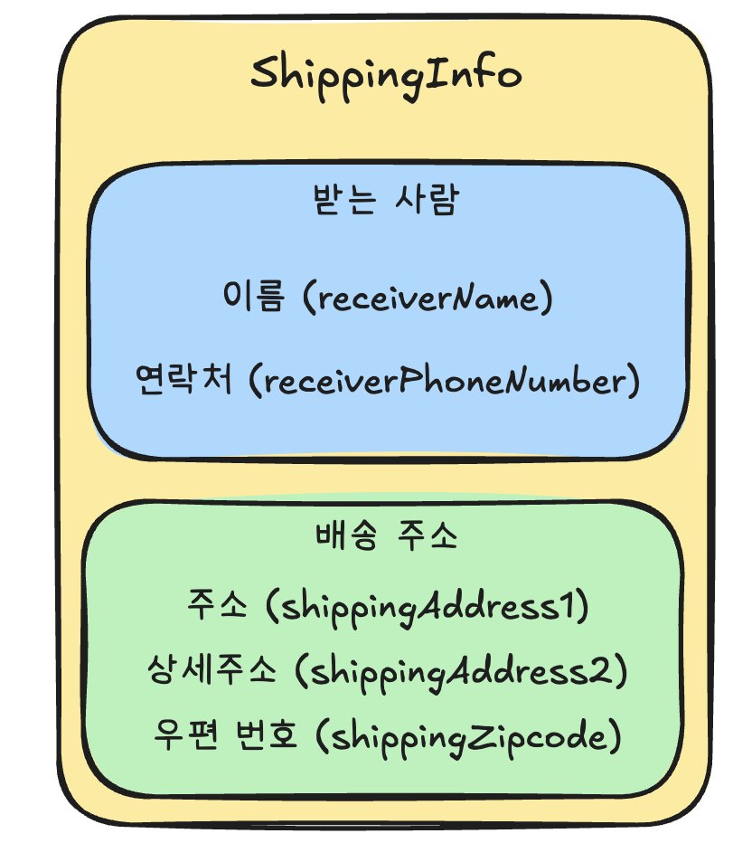
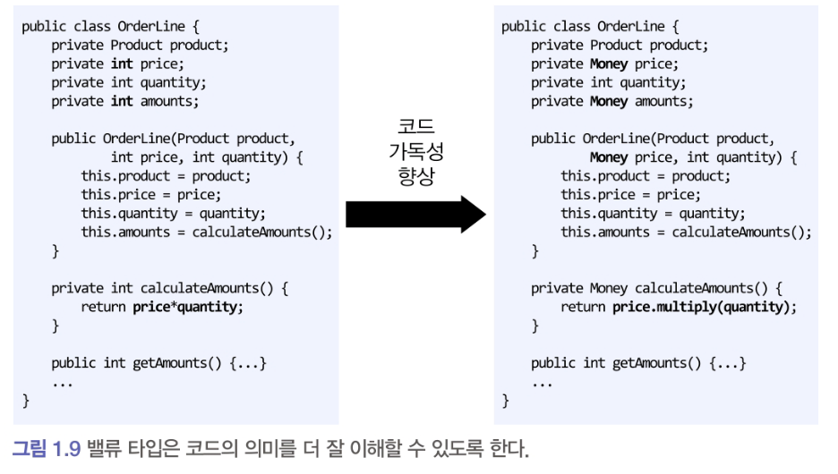
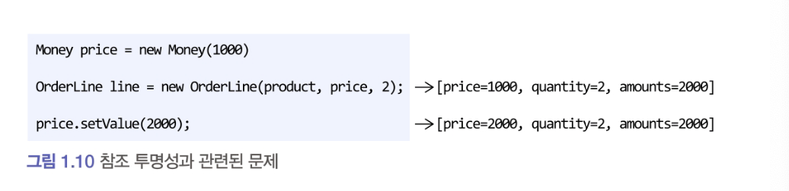

# 1.6.3 밸류 타입

- ShippingInfo 클래스는 다음과 같이 받는 사람과 주소에 대한 데이터를 갖고 있다.



### Receiver.class

```java
public class Receiver {
  private String name;
  private String phoneNumber;

  public Receiver (String name, String phoneNumber) {
    this.name = name;
    this.phoneNumber = phoneNumber;
  }

  public String getName() {
    return name;
  }

  public String getPhoneNumber() {
    return phoneNumber;
  }
}
```

- Reveiver 는 '받는 사람' 이라는 도메인 개념을 표현한다.
- 밸류 타입을 사용하면 개념적으로 완전한 하나를 잘 표현할 수 있다.

### Address.class

```java
public class Address {
  private String address1;
  private String address2;
  private String zipcode;

  public Address (String address1, String address2 ,String zipcode) {
    this.address1 = address1;
    this.address2 = address2;
    this.zipcode = zipcode;
  }

  //get 메서드
}
```

### ShippingInfo.class

```java
public class ShippingInfo {
  private Receiver receiver; //받는 사람
  private Address address; //주소

	... 생성자, get 메서드
}
```

## 밸류 타입을 사용하면 의미를 명확히 표현할 수 있다
### OrderLine.class

```java

public class OrderLine {
  private Product product; //상품
  private int price; //가격
  private int quantity; // 수량
  private int amounts; // 총 금액

	...
}


```

price와 amounts는 int 타입의 숫자를 사용하고 있지만 이들은 '돈'을 의미하는 값이다.
따라서 '돈'을 의미하는 `Money` 타입을 만들어 사용하면 코드를 이해하는 데 도움이 된다.
### Money.class

```java

public class Money {
  private int value;

  public Money(int value) {
    this.value = value;
  }

  public int getValue() {
    return this.value;
  }
}

```

### Money를 사용한 OrderLine.clss

```java

public class OrderLine {
  private Product product; //상품
  private Money price; //가격
  private int quantity; // 수량
  private Money amounts; // 총 금액

  ...
}


```


## 밸류타입을 위한 기능을 추가할 수 있다.

### Money.class

```java
public class Money {
  private int value;

	...생성자, getValue();

  public Money add(Money money){
    return new Money(this.value + money.value);
  }

  public Money multiply(int multiplier){
    return new Money(value * multiplier);
  }
}
```

Money 를 사용하는 코드는 `정수타입 연산`이  아닌 `돈 계산`이라는 의미로 코드를 작성할 수 있다.



## 밸류 객체의 데이터를 변경할 때는 새로운 객체를 생성하는 방식을 선호한다.

```java
public class Money {
  private int value;

  public Money add(Money money){
    return new Money(this.value + money.value);
  }
  //value를 변경할 수 있는 메서드 없음
}
```

- 데이터 변경 기능을 제공하지 않는 타입을 불변이라고 표현한다.
- 불변으로 구현하게되면 안전한 코드를 작성할 수 있다.

#### Money의 값을 변경할 수 있는 경우



> 참조투명성은 **동일한 입력에 대해 항상 동일한 출력을 반환하고, 부수효과(side effect)가 없는 특성**을 의미한다.
>  즉, 어떤 표현식을 그 결과값으로 치환해도 프로그램의 동작이 변하지 않는 특성을 말한다.

 ```java
Money price = new Money(1000);
OrderLine line = new OrderLine(product, price, 2); // 총 금액 = 2000
price.setValue(2000); 
```

이 코드는 참조투명성을 위반한다 `price` 객체의 상태가 변경되면서 이미 생성된 `OrderLine` 객체의 `amount` 계산 결과도 영향을 받게된다. (price= 2000, aounts 기댓값 -> 4000, 근데 2000)

이 문제를 방지하려면 OrderLine 생성자는 새로운 Money 객체를 생성하도록 작성해야 한다.

```java
public class OrderLine {
	...
  private Money price;

  public OrderLine(Product product, Money price, int quantity){
    this.product = product;
    //Money가 불변 객체가 아니라면 변경될 수 있으므로, 
    //깊은복사(방어적 복사)를 해서 전달한다.
    this.price = new Money(price.getValue());
    this.quantity = quantity;
    this.amounts = calculateAmounts();
  }

}

Money가 불변이면 이런 코드를 작성할 필요가 없다. Money의 데이터를 바꿀 수 없기 때문이다.
이 경우 파라미터로 전달받은 price를 안전하게 사용할 수 있다.

## 두 밸류 객체를 비교할 때는 모든 속성이 같은지 비교한다.

```java
public class Receiver {
  private String name;
  pricate String phoneNumber;

  public boolean equals(Object other) {
    if(other == null) return false;
    if(this == other) return true;
    if(! (other) instanceof Receiver)) return false;
    Receiver that = (Receiver)other;
    returh this.name.equals(that.name) &&
        this.phoneNumber.equals(that.phoneNumber);
  }
}
```