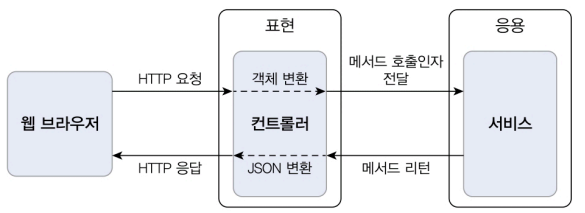
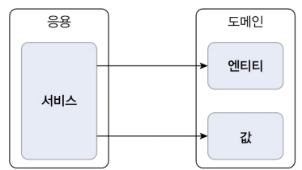
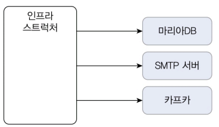

# 2.1 네 개의 영역

'표현', '응용', '도메인', '인프라스트럭처'는 아키텍처를 설계할 때 출현하는 전형적인 네 가지 영역이다.

## 1. 표현 영역 (Presentation Layer)

사용자의 요청을 받아 응용 영역에 전달하고 응용 영역의 처리 결과를 다시 사용자에게 보여주는 역할을 한다. 

- 스프링 MVC 프레임워크가 표현 영역을 위한 기술에 해당
-  표현 영역의 사용자: 웹 브라우저를 사용하는 사람일 수도 있고, REST API를 호출하는 외부 시스템일 수도 있다.



- HTTP 요청을 응용 영역이 필요로 하는 형식으로 변환해서 응용 영역에 전달하고 응용 영역의 응답을 HTTP 응답으로 변환하여 전송
  - ex
    - 웹 브라우저가 `HTTP 요청 파라미터`로 전송한 데이터를 `응용 서비스가 요구하는 형식의 객체 타입으로 변환`해서 전달
    - `응용 서비스가 리턴한 결과`를 `JSON` 형식으로 변환해서 HTTP 응답으로 웹 브라우저에 전송

## 2. 응용 영역 (Application Layer)

사용자가 요청한 시스템 기능을 정의하고 조율한다.



- 기능을 구현하기 위해 도메인 영역의 도메인 모델을 사용
  - ex.주문 취소 기능 - 주문 도메인 모델을 사용해서 기능을 구현
     -  ```java
        public class CancelOrderService {
            @Transactional
            public void cancelOrder(String orderId) {
                Order order = findOrderById(orderId);
                if (order == null) throw new OrderNotFoundException(orderId);
                order.cancel(); // 주문 취소 로직을 직접 구현하지 않고 Order 객체에 취소 처리를 위임
            }
        }
        ```
- 로직을 직접 수행하기보다는 도메인 모델에 로직 수행을 위임
- 예: 주문 등록, 주문 취소, 상품 조회 등의 기능 제공

## 3. 도메인 영역 (Domain Layer)

도메인 모델을 구현한다. 시스템의 핵심 비즈니스 로직을 구현한다.

- 예: 주문(Order), 주문 항목(OrderLine), 배송 정보(ShippingInfo)같은 도메인 모델
  - 주문 도메인은 '배송지 변경', '결제 완료', '주문 총액 계산과 같은 핵심 로직을 도메인 모델에서 구현

## 4. 인프라스트럭처 영역 (Infrastructure Layer)

구현 기술에 대한 것을 다룬다. 시스템 구현에 필요한 기술적 기반을 제공한다.



- RDBMS, MongoDB, Redis 등 데이터 저장소 연동
- 외부 시스템 연동 (메일 전송, REST API 호출, 메시징 큐 등)
- ORM, 파일 시스템, SMTP, HTTP 클라이언트 등의 구현 기술 포함

---

- 도메인 영역, 응용 영역, 표현 영역은 구현 기술을 사용한 코드를 직접 만들지 않는다.
  - 대신 인프라스트럭처 영역에서 제공하는 기능을 사용해서 필요한 기능을 개발
    - ex
      - 응용 영역에서 DB에 보관된 데이터가 필요하면 인프라스트럭처 영역의 DB 모듈을 사용해 데이터 조회
      - 외부에 메일을 발송해야 한다면 인프라스트럭처가 제공하는 SMTP 연동 모듈을 이용해 메일 발송

