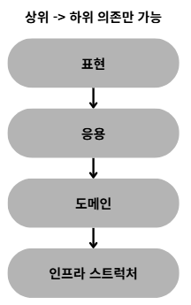
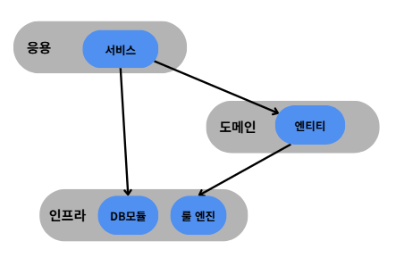

# 2.2 계층 구조 아키텍처
## 계층구조의 기본 개념
네 영역을 구성할때 많이 사용하는 아키텍처가 아래 그림과 같은 계층 구조이다.

표현 영역과 응용 영역은 도메인영역을 사용하고

도메인 영역은 인프라 스트럭처 영역을 사용하므로 계층구조를 적용하기 적당하다

도메인 복잡도에따라 응용과 도메인 영역을 합치기도 한다.



## 계층구조의 유연성
계층 구조를 엄격하게 적용한다면 상위계층은 바로 아래 계층에만 의존을 가져야 하지만 구현의 편리함을 위해 계층 구조를 유연하게 적용하기도 한다.

ex)응용 계층은 도메인계층에 의존하지만 외부시스템과 연동을 위해 인프라 스트럭처 계층에 의존하기도 한다.

아래와 같은 계층구조를 사용하는 것을 이해하기 쉽지만 상세한 구현 기술을 다루는 인프라 계층에 종속된다.



---
## 인프라계층 사용 예시 

인프라 영역의 Drools라는 룰엔진을 사용하여 별도 파일로 작성한 규칙을 이용해서 연산을 수행하는 evalutate() 메소드를 만들었다.

### 인프라 계층 Drools클래스
```java
public class DroolsRuleEngine {

  private final KieContainer kieContainer;

  //가격 계산을 수행하는 로직
  public void evaluate(String sessionName, List<?> facts) {
    //sessionName을 받아서 kSession을 생성
    KieSession kSession = kieContainer.newKieSession(sessionName);
    try{
      facts.forEach(kSession::insert);
      kSession.fireAllRules();
    }finally {
      kSession.dispose();
    }
  }
}
```
그리고 응용 계층에서 가격 계산을 위해 인프라영역에 있는 DroolsRuleEngine을 사용한다.

### 응용 계층 서비스 로직
```java
class CalculateDiscountService{
    private final DroolsRuleEngine droolsRuleEngine;

    public Money calculateDiscount(List<OrderLine> orderLines, String customerId){
      Customer customer = findCustomer(customerId);

      //Drools에 특화된 코드
      MutableMoney money = new MutableMoney(0);
      List<?> facts = Arrays.asList(customer, money);
      facts.addAll(orderLines);
      droolsRuleEngine.evaluate("discountCalculation", facts);
      return money.toImmutableMoney();
    }
  }
  ```
이 코드는 동작은 하겠지만 두가지 문제가 있다


1. CalculateDiscountService만 테스트 하기 어렵다.

 - Service를 테스트 하려면 droolsRuleEngine이 완벽하게 동작을 해야한다 즉, DroolsRuleEngine클래스및 관련 설정을 한 이후에 비로소 테스트가 가능해진다.

 

2. 구현 방식을 변경하기 어렵다
```java
//Drools의 연산 결과값을 받기 위해 추가한 타입
MutableMoney money = new MutableMoney(0);
//Drools의 필요한 데이터(지식)를 알아야 한다.
List<?> facts = Arrays.asList(customer, money);
facts.addAll(orderLines);
//discountCalculator는 Drools의 세션이름으로 Drools를 알아야 하고
//evaluate안의 세션을 수정해야할시 이 메소드 또한 수정해야한다. 
droolsRuleEngine.evaluate("discountCalculator", facts);
return money.toImmutableMoney();
```
이 처럼 실제로 Drools라는 인프라 영역의 기술에 완전하게 의존하고있다.

이런 상황에서 Drools가 아닌 다른 구현기술을 사용하려면 코드의 많은 부분을 고쳐야 한다.


**해결책: DIP(의존성 역전 원칙)**