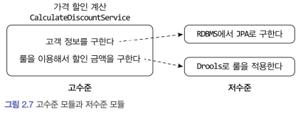
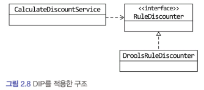
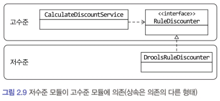

# 2.3 DIP

- 가격 할인 계산 로직 설계 및 DIP 적용
  -  고객 정보를 구해야 하고, 구한 고객 정보와 주문 정보를 이용해서 룰을 실행해야 한다.
    - 

## 고수준 모듈과 저수준 모듈
- 고수준 모듈: 의미 있는 단일 기능을 제공하는 모듈
  - 고수준 모듈의 기능을 구현하려면 여러 하위 기능이 필요하다.
  - ex: `CalculateDiscountService`: "가격 할인 계산"이라는 단일 의미의 기능을 제공
    - 필요한 하위 기능
      - 고객 정보 조회
      - 할인 룰 적용
- 저수준 모듈: 고수준 모듈에서 필요한 하위 기능들을 실제로 구현
  - ex
    - JPA 기반 고객 정보 조회 모듈
    - Drools 기반 할인 룰 적용 모듈

### 문제점

- 고수준 모듈이 저수준 모듈에 직접 의존하면 구현 변경 시 영향이 크고, 테스트가 어렵다.

## DIP(Dependency Inversion Principle)

> DIP: 고수준 모듈이 저수준 모듈에 의존하지 않도록 설계하는 원칙

- DIP는 이 문제를 해결하기 위해 저수준 모듈이 고수준 모듈에 의존하도록 바꾼다.

### 추상화한 인터페이스: 저수준 모듈이 고수준 모듈에 의존하도록 하는 방법

Calculate DiscountService 입장에서 봤을 때 룰 적용을 Drools로 구현했는지 자바로 직접 구현했는지는 중요하지 않다. 

- '고객 정보와 구매 정보에 룰을 적용해서 할인 금액을 구한다'라는 것만 중요 
#### 이를 추상화한 인터페이스
```java
public interface RuleDiscounter {
Money applyRules(Customer customer, List<OrderLine> orderLines);
}
```
#### 추상화한 인터페이스를 사용한 Service
```java
public class CalculateDiscountService {
    private final RuleDiscounter ruleDiscounter;

    public CalculateDiscountService(RuleDiscounter ruleDiscounter) {
        this.ruleDiscounter = ruleDiscounter;
    }

    public Money calculateDiscount(List<OrderLine> orderLines, String customerId) {
        Customer customer = findCustomer(customerId);
        return ruleDiscounter.applyRules(customer, orderLines);
    }

}
```
- CalculateDiscountService에는 Drools에 의존하는 코드가 없다. 
  - RuleDiscounter가 룰을 적용한다는 사실만 알뿐
  - 실제 Rule Discounter의 구현 객체는 생성자를 통해서 전달받는다.
####  Drools 기반 구현체
```java
public class DroolsRuleDiscounter implements RuleDiscounter {
    private KieContainer kContainer;

    public DroolsRuleDiscounter() {
        KieServices ks = KieServices.Factory.get();
        kContainer = ks.getKieClasspathContainer();
    }

    @Override
    public Money applyRules(Customer customer, List<OrderLine> orderLines) {
        KieSession kSession = kContainer.newKieSession("discountSession");
        try {
            // 고객 및 주문 정보 설정
            // 룰 실행
            kSession.fireAllRules();
        } finally {
            kSession.dispose();
        }
        return money.toImmutableMoney(); // 결과 반환
    }
}
```
- 룰 적용을 구현한 클래스는 RuleDiscounter 인터페이스를 상속받아 구현한다. 

### DIP를 적용한 구조



- CalculateDiscountService는 구현 기술인 Drools에 의존하지 않는다. 
  - '룰을 이용한 할인 금액 계산을 추상화한 RuleDiscounter 인터페이스에 의존
    > '룰을 이용한 할인 금액 계산은 고수준 모듈의 개념이므로 `RuleDiscounter` 인터페이스는 고수준 모듈에 속한다. 
    > 
    > `DroolsRuleDiscounter`는 고수준의 하위 기능인 `RuleDiscounter`를 구현한 것이므로 저수준 모듈에 속한다.
    > 
    >  

DIP를 적용하면 저수준 모듈이 고수준 모듈에 의존하게 된다. 
> 고수준 모듈이 저수준 모듈을 사용하려면 고수준 모듈이 저수준 모듈에 의존해야 하는데, 
> 
> 반대로 저수준 모듈이 고수준 모듈에 의존한다고 해서 이를 DIPDependency Inversion Principle 의존 역전 원칙이라고 부른다.

### DIP 적용의 이점

- 구현 기술 변경이 용이해진다.
  - 고수준 모듈이 구현 세부사항에 의존하지 않기 때문에 다양한 기술로 구현된 하위 모듈을 쉽게 교체할 수 있다.

- 테스트가 쉬워진다.
  - 실제 구현체가 없어도 인터페이스 기반의 스텁이나 목(mock) 객체를 사용하여 고수준 모듈을 독립적으로 테스트할 수 있다.

#### 1. 구현 기술 교체 유연성

고수준 모듈은 (저수준 모듈에 의존하지 않고)구현을 추상화한 인터페이스에 의존한다. 

실제 사용할 저수준 구현 객체는 의존 주입을 이용해서 전달받을 수 있다.
```java
// Drools 기반 구현체 주입
RuleDiscounter ruleDiscounter = new DroolsRuleDiscounter();
CalculateDiscountService disService = new CalculateDiscountService(ruleDiscounter);
```

구현 기술을 교체하더라도 다음과 같이 저수준 구현 객체를 생성하는 코드만 변경하면 된다.

```java
// 사용할 저수준 구현 객체 변경
RuleDiscounter ruleDiscounter = new SimpleRuleDiscounter();
// 사용할 저수준 모듈을 변경해도 고수준 모듈을 수정할 필요가 없다.
CalculateDiscountService disService = new CalculateDiscountService(ruleDiscounter);
```

> 참고: Spring과 같은 DI(Dependency Injection) 프레임워크를 사용하면 설정 파일만 변경하여 구현체를 바꿀 수 있다.

#### 2. 테스트 용이성 확보

##### 상황

- CalculateDiscountService는 할인 계산 기능을 테스트하기 위해 두 인터페이스를 사용한다
  - CustomerRepository: 고객 정보를 조회
  - RuleDiscounter: 할인 룰 적용

```java
public class CalculateDiscountService {
    private final CustomerRepository customerRepository;
    private final RuleDiscounter ruleDiscounter;

    public CalculateDiscountService(CustomerRepository customerRepository, RuleDiscounter ruleDiscounter) {
        this.customerRepository = customerRepository;
        this.ruleDiscounter = ruleDiscounter;
    }

    public Money calculateDiscount(List<OrderLine> orderLines, String customerId) {
        Customer customer = findCustomer(customerId);
        return ruleDiscounter.applyRules(customer, orderLines);
    }

    private Customer findCustomer(String customerId) {
        Customer customer = customerRepository.findById(customerId);
        if (customer == null) throw new NoCustomerException();
        return customer;
    }
}
```

- CalculateDiscountService가 제대로 동작하는지 테스트하려면 CustomerRepository와 RuleDiscounter를 구현한 객체가 필요
  - CalculateDiscountService가 저수준 모듈에 직접 의존 ➡️ 저수준 모듈이 만들어지기 전까지 테스트 불가
  - CustomerRepository와 RuleDiscounter는 인터페이스 ➡️ 대역 객체를 사용해서 테스트 가능

##### 대역 객체를 사용한 테스트 코드

아래는 Customer가 존재하지 않는 경우 익셉션이 발생하는지 검증하는 테스트 코드의 예시다.

```java
public class CalculateDiscountServiceTest {

    @Test
    public void noCustomer_thenExceptionShouldBeThrown() {
        // CustomerRepository에 대한 스텁(mock) 생성
        CustomerRepository stubRepo = mock(CustomerRepository.class);
        when(stubRepo.findById("noCustId")).thenReturn(null);

        // RuleDiscounter는 람다식으로 간단히 대체
        RuleDiscounter stubRule = (cust, lines) -> null;

        // 대역 객체 주입
        CalculateDiscountService calDisSvc =
            new CalculateDiscountService(stubRepo, stubRule);

        // 고객이 존재하지 않는 경우 예외 발생 검증
        // null을 리턴하고 결과적으로 NoCustomerException을 발생
        assertThrows(NoCustomerException.class, () ->
            calDisSvc.calculateDiscount(someLines, "noCustId")
        );
    }
}
```

- 핵심 포인트
  - stubRepo와 stubRule은 테스트 목적의 (CustomerRepository와 Rule Discounter의)대역 객체(stub/mock)이다.
    - stubRepo는 Mockito라는 Mock 프레임워크를 이용해서 대역 객체를 생성
    - stubRule은 메서드가 한 개여서 람다식을 이용해 객체를 생성
    - 두 대역 객체는 테스트를 수행하는 데 필요한 기능만 수행
  - 실제 데이터베이스나 Drools 룰 엔진 없이도 테스트를 수행 가능
    -  CustomerRepository와 RuleDiscounter의 실제 구현 클래스가 없어도 CalculateDiscountService를 테스트할 수 있음을 보여줌
  - DIP 덕분에 고수준 모듈이 저수준 모들에 의존하지 않게 되어 고수준 모듈을 독립적으로 검증 가능
