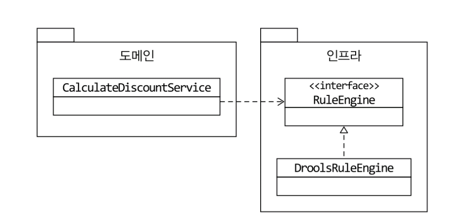
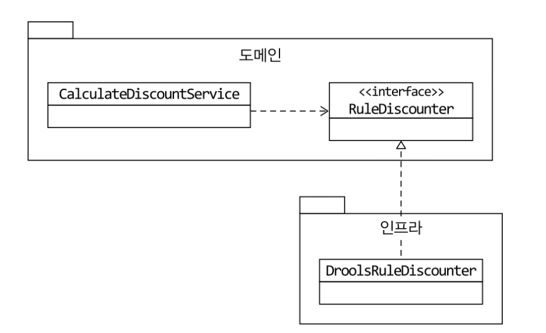
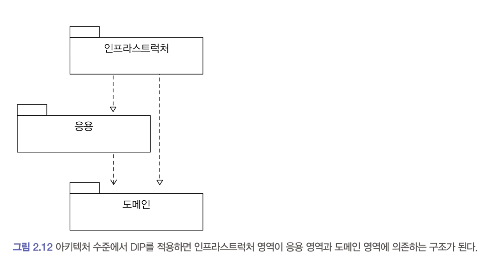
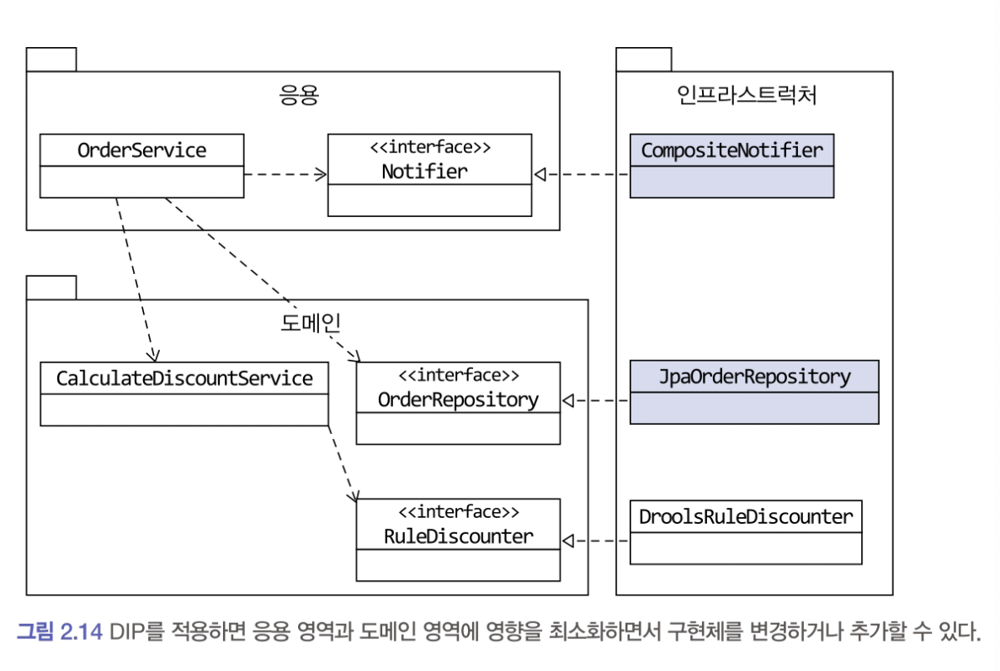

# 2.3 DIP

## 2.3.1 DIP 주의사항

DIP를 잘못 생각하면 단순히 인터페이스와 구현 클래스를 분리하는 정도로 받아들일 수 있다.
DIP의 핵심은 고수준 모듈이 저수준 모듈에 의존하지 않도록 하기 위함인데, 아래과같이 저수준 모듈에서 인터페이스를 추출하는 경우가 있다

위는 잘못된 구조이다.
이 구조에서 도메인 영역은 구현 기술을 다루는 인프라스트럭처 영역에 의존하고 있다
여전히 고수준 모듈(도메인)이 저수준 모듈(인프라)에 의존하고 있는 것이다.

RuleEnging 인터페이스를 도메인 관점이 아닌, 룰 엔진이라는 저수준 모듈 관점에서 도출한 것이다.
DIP를 적용할 때 하위 기능을 추상화한 인터페이스는 고수준 모듈 관점에서 도출한다.

고수준 모듈 (CalculateDiscountService) 입장에서 봤을 때 룰 엔진을 사용하는지, 직접 연산하는지는 중요하지 않다. 단지 `규칙` 에 따라 `할인금액을 계산`한다는 것이 중요할 뿐이다.

즉 `할인 금액 계산` 을 추상화한 인터페이스는 저수준 모듈이 아닌 **고수준 모듈** 에 위치한다.

## 2.3.2 DIP와 아키텍처

인프라스트럭쳐 영역 : 구현기술을 다루는 저수준 모듈
응용 영역, 도메인 영역 : 고수준 모듈

인프라스트럭쳐 계층이 가장 하단에 위치하는 계층형 구조와 달리, 아키텍쳐에 DIP를 적용하면 인프라 스트럭쳐 영역이 응용 영역과 도메인 영역에 의존(상속)하는 구조가 된다.

인프라 스트럭쳐에 위치한 클래스가 도메인, 응용영역에 정의한 인터페이스를 상속받아 구현하는 구조가 된다.
인프라스트럭쳐가 도메인, 응용영역에 대한 영향을 주지않거나 최소화하면서 구현 기술을 변경하는 것이 가능하다.

인프라 스트럭쳐의 EmailNotifier 는 응용 영역의 Notifier 인터페이스를 상속받고 있다.
추가 요구사항이 들어왔을 때(SMS 추가 등)에도 응용 영역의 OrderService는 변경할 필요가 없다.

두 통지 방식을 함께 제공하는 Notifier 구현 클래스를 인프라 스트럭쳐 영역에 추가하면 된다.
비슷하게 JPA를 구현 기술로 사용하고 싶다면, JPA를 이용한 OrderRepository 구현 클래스를 인프라 스트럭쳐 영역에 추가하면 된다.

> DIP를 항상 적용할 필요는 없다. 완벽한 DIP를 적용하기 보다는 구현 기술에 의존적인 코드를 도메인에 일부 포함하는  게 효과적일 때도 있다. (`@Entity` , lombok 등) 또는 추상화 대상이 잘 떠오르지 않을 때도 있다.
> 이럴 때는 무조건 DIP를 적용하려고 시도하기 보다는, DIP의 이점을 얻는 수준에서 적용 범위를 검토해 보자.