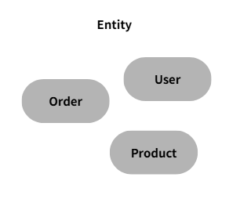
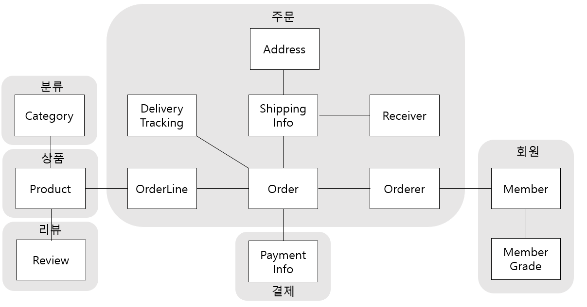

# 2.4 도메인 영역의 주요 구성요소

#### 1. 엔티티 (Entity)

- 고유 식별자를 가지며 자신의 **라이프사이클**을 가짐
- **데이터와 관련된 도메인 기능**을 함께 제공

**예시:** 주문, 회원, 상품



---

#### 2. 밸류 (Value Object)

- 고유 식별자를 가지지 않음
- **의미상 하나의 개념을 표현하는 객체**
- 엔티티의 속성으로 사용되며, 다른 밸류 타입의 속성으로도 사용 가능

**예시:** 주소, 금액


---

#### 3. 애그리거트 (Aggregate)

- 연관된 **엔티티와 밸류 객체를 하나의 군(단위)**으로 묶은 것
- **루트 엔티티(Aggregate Root)**가 존재하며, 외부에서는 루트 엔티티를 통해서만 내부에 접근


---

#### 4. 리포지토리 (Repository)

- 도메인 객체의 **영속성 처리 담당 (저장, 조회 등)**
- DB와 도메인 객체 간 매핑을 담당하는 계층

---

#### 5. 도메인 서비스 (Domain Service)

- 특정 엔티티에 속하지 않는 **도메인 로직**을 처리
- 여러 엔티티와 밸류를 사용하는 로직을 담당

**예시:** 할인 금액 계산
> 상품, 쿠폰, 구매 금액, 회원 등급 등 다양한 조건이 필요한 경우 도메인 서비스에 구현

---


DB테이블의 엔티티와 VS 도메인 모델의 엔티티

도메인 모델의 엔티티

- 데이터와 함께 도메인 기능을 함께 제공

- 단순히 데이터를 담고있는 데이터 구조가 아니라 데이터와 함께 기능을 제공하는것 
- 도메인 관점에서 기능을 구현하고 기능 구현을 캡슐화
- 메인 모델의 엔티티는 두 개 이상의 데이터가 개념적으로 하나인 경우 밸류타입을 이용해서 표현가능


### 1. 엔티티 (Entity)

#### 예시 코드
```java
public class Order {
    private OrderNo number;
    private Orderer orderer;
    private ShippingInfo shippingInfo;

    public void changeShippingInfo(ShippingInfo newShippingInfo) {
        checkShippingInfoChangeable();
        setShippingInfo(newShippingInfo);
    }

    private void setShippingInfo(ShippingInfo newShippingInfo) {
        if (newShippingInfo == null) throw new IllegalArgumentException();
        this.shippingInfo = newShippingInfo;
    }
}
```

- `Orderer`는 밸류 타입으로 다음과 같이 정의할 수 있음:

```java
public class Orderer {
    private String name;
    private String email;
}
```
### 2. 밸류 (Value)


RDBMS에서는 밸류 타입을 제대로 표현하기 어려워, 테이블에 직접 컬럼으로 저장하거나 별도 테이블로 분리하여 저장해야 함.
> - 직접 컬럼저장시 주문자라는 개념이 드러나지 않고 주문자의 개별 데이터만 드러남
> - 별도 테이블로 분리시 엔티티에 가까우며 밸류타입의 의미가 드러나지 않음

반면 위 코드와 같이 도메인 모델의 경우 주문자라는 개념을 잘 반영한여 도메인을 보다 잘 이해할 수 있음 

밸류는 불변으로 구현할것을 권장 -> 엔티티의 밸류가 교체될때 완전히 교체한다
#### 예시 코드
```java
public class Order{
private SHippingInfo shippingInfo;
    //도메인 모델 엔티티는 도메인 기능도 함께 제공
    public void changeShippingInfo(ShippingInfo newShippingInfo){
        checkShippingInfoChangeable();
        setShippingInfo(newShippingInfo);
    }
    
    private void ShippingInfo(ShippingInfo newShippingInfo){
        if(newShippingInfo == null) throw new IllegalArgumentException();
        //밸류 타입의 데이터를 변경할 때는 새로운 객체로 교체
        this.shippingInfo = newShippingInfo;
    }
}
```
