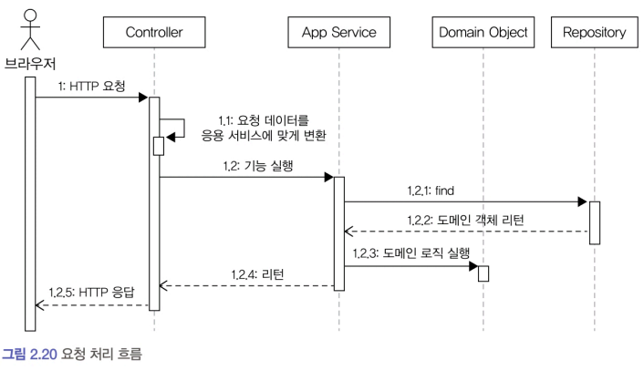

# 2.5 요청 처리 흐름

사용자 입장에서 웹 애플리케이션이나 데스크톱 애플리케이션과 같은 소프트웨어는 기능을 제공한다.   

### 표현 영역
- 사용자가 애플리케이션에 기능 실행을 요청하면 그 요청을 처음 받는 영역은 표현 영역이다.   
    - 스프링 MVC를 사용해서 웹 애플리케이션을 구현했다면 컨트롤러가 사용자의 요청을 받아 처리하게 된다.
- 표현 영역은 사용자가 전송한 데이터 형식이 올바른지 검사하고 문제가 없다면 데이터를 이용해서 응용 서비스에 기능 실행을 위임한다. 
    - 이때 표현 영역은 사용자가 전송한 데이터를 응용 서비스가 요구하는 형식으로 변환해서 전달한다. 
    - 웹 브라우저를 이용해 기능 실행을 요청하면 표현 영역에 해당하는 컨트롤러는 HTTP 요청 파라미터를 응용 서비스가 필요로 하는 데이터로 변환해서 응용 서비스를 실행할 때 인자로 전달한다.

### 응용 서비스
- 응용 서비스는 도메인 모델을 이용해서 기능을 구현한다. 
    - 기능 구현에 필요한 도메인 객체를 리포지터리에서 가져와 실행하거나 신규 도메인 객체를 생성해서 리포지터리에 저장한다. 
        - 두 개 이상의 도메인 객체를 사용해서 구현하기도 한다.
    - '예매하기'나 '예매 취소'와 같이 도메인의 상태를 변경하는 기능을 제공하는 응용 서비스는 변경 상태가 물리 저장소에 올바르게 반영되도록 **트랜잭션**을 관리해야 한다. 
        - 예를 들어 스프링 프레임워크를 사용하면 @Transactional 애너테이션을 이용해서 트랜잭션을 처리할 수 있을 것이다.

# 2.6 인프라스트럭처 개요

인프라스트럭처Infrastructure는 표현 영역, 응용 영역, 도메인 영역을 지원한다.   
도메인 객체의 영속성 처리, 트랜잭션, SMTP 클라이언트, REST 클라이언트 등 다른 영역에서 필요로 하는 프
레임워크, 구현 기술, 보조 기능을 지원한다.   
DIP에서 언급한 것처럼 도메인 영역과 응용 영역에서 인프라스트럭처의 기능을 직접 사용하는 것보다 이 두 영역에 정의한 인터페이스를 인프라스트럭처 영역에서 구현하는 것이 시스템을 더 유연하고 테스트하기 쉽게 만들어준다.  

그렇다고 해서 무조건 인프라스트럭처에 대한 의존을 없앨 필요는 없다.   
#### 예를 들어
- 스프링을 사용할 경우 응용 서비스는 트랜잭션 처리를 위해 @Transactional을 사용하는 것이 편리하다. 
- 영속성 처리를 위해 JPA를 사용할 경우 @Entity나 @Table과 같은 JPA 전용 애너테이션을 도메인 모델 클래스에 사용하는 것이 XML 매핑 설정을 이용하는 것보다 편리하다.

구현의 편리함은 DIP가 주는 다른 장점(변경의 유연함, 테스트가 쉬움) 만큼 중요하기 때문에 DIP의 장점을 해치지 않는 범위에서 응용 영역과 도메인 영역에서 구현 기술에 대한 의존을 가져가는 것이 나쁘지 않을 수 있다.  
응용 영역과 도메인 영역이 인프라스트럭처에 대한 의존을 완전히 갖지 않도록 시도하는 것은 자칫 구현을 더 복잡하고 어렵게 만들 수 있기 때문이다.  
#### 좋은 예 - 스프링의 @Transactional 애너테이션
- @Transactional을 사용하면 한 줄로 트랜잭션을 처리할 수 있는데 코드에서 스프링에 대한 의존을 없애려면 복잡한 스프링 설정을 사용해야 한다.
    - 의존은 없었지만 특별히 테스트를 더 쉽게 할 수 있다거나 유연함을 증가시켜 주지 못한다. 
    - 단지 설정만 복잡해지고 개발 시간만 늘어날 뿐이다.

표현 영역은 항상 인프라스트럭처 영역과 쌍을 이룬다. 
- 스프링 MVC를 사용해서 웹 요청을 처리하면 스프링이 제공하는 MVC 프레임워크에 맞게 표현 영역을 구현해야 하고, Vert.x를 사용해서 REST API 서버를 구축하려면 Vert.x에 맞게 웹 요청 처리 부분을 구현해야 한다.
- 표현 영역은 사용자의 요청/응답을 처리하는 층으로, 사용하는 프레임워크나 기술(Stack)에 따라 자연스럽게 인프라스트럭처와 밀접하게 결합된다.
- 즉, Spring MVC, Vert.x, Express.js, Django 등 어떤 걸 쓰냐에 따라 표현 영역의 구현 방식은 달라질 수밖에 없고, 이 둘은 항상 쌍을 이룬다는 것이다.