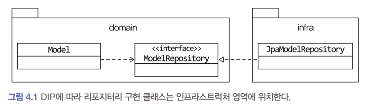

# 4.1 JPA를 이용한 리포지터리 구현

- 데이터 보관소로 RDBMS를 사용할 때, 객체 기반의 도메인 모델과 관계형 데이터 모델 간의 매핑을 처리하는 기술로 ORM을 활용한다.
- 자바의 ORM 표준인 JPA를 이용해서 리포지터리와 애그리거트를 구현하는 방법을 알아본다.

## 4.1.1 모듈 위치
리포지터리 인터페이스는 애그리거트와 같이 도메인 영역에 속하고, 리포지터리를 구현한 클래스는 인프라스트럭처 영역에 속한다.

- 팀 표준에 따라 리포지터리 구현 클래스를 domain.impl과 같은 패키지에 위치시킬 수도 있는데 이것은 리포지터리 인터페이스와 구현체를 분리하기 위한 타협안 같은 것이지 좋은 설계 원칙을 따르는 것은 아니다.
- 가능하면 리포지터리 구현 클래스를 인프라스트럭처 영역에 위치시켜서 인프라스트럭처에 대한 의존을 낮춰야 한다.

## 4.1.2 리포지터리 기본 기능 구현

리포지터리가 제공하는 기본 기능
- ID로 애그리거트 조회하기
- 애그리거트 저장하기

인터페이스는 애그리거트 루트를 기준으로 작성한다.

### 조회

- 애그리거트를 조회하는 기능의 이름을 지을 때 특별한 규칙은 없지만, 널리 사용되는 규칙은 'findBy프로퍼티이름(프로퍼티 값)' 형식을 사용하는 것이다. 
- 위 인터페이스는 ID로 애그리거트를 조회하는 메서드 이름을 findById()로 지정했다.
- findById()는 ID에 해당하는 애그리거트가 존재하면 객체를 리턴하고 존재하지 않으면 null을 리턴한다. null을 사용하고 싶지 않다면 다음과같이 Optional을 사용해도 된다.
- ID가 아닌 다른 조건으로 애그리거트를 조회할 때는 findBy 뒤에 조건 대상이 되는 프로퍼티 이름을 붙인다.
- 한 개 이상의 객체를 리턴할 수 있는 조회 메소드의 경우 컬렉션 타입 중 하나인 List를 리턴 타입으로 사용할 수 있다.
    - ID 외에 다른 조건으로 애그리거트를 조회할 때에는 JPA의 Criteria나 JPQL을 사용할 수 있다.

### 저장
- save() 메서드는 전달받은 애그리거트를 저장한다.

### 삭제
- 삭제 요구사항이 있더라도 데이터를 실제로 삭제하는 경우는 많지 않다. 
- 관리자 기능에서 삭제한 데이터까지 조회해야 하는 경우도 있고 데이터 원복을 위해 일정 기간 동안 보관해야 할 때도 있기 때문이다. 
- 즉, 사용자가 삭제 기능을 실행할 때 데이터를 바로 삭제하기보다는 삭제 플래그를 사용해서 데이터를 화면에 보여줄지 여부를 결정하는 방식으로 구현한다.

#### 참고
- 스프링과 JPA로 구현할 때 스프링 데이터 JPA를 사용한다. 
- 리포지터리 인터페이스만 정의하면 나머지 리포지터리 구현 객체는 스프링 데이터 JPA가 알아서 만들어준다.

### 그 외
- 애그리거트를 수정한 결과를 저장소에 반영하는 메서드를 추가할 필요는 없다. JPA를 사용하면 트랜잭션 범위에서 변경한 데이터를 자동으로 DB에 반영하기 때문이다. 
- 예를 들어 changeShippingInfo () 메서드는 스프링 프레임워크의 트랜잭션 관리 기능을 통해 트랜잭션 범위에서 실행된다. 
    - 메서드 실행이 끝나면 트랜잭션을 커밋하는데 이때 JPA는 트랜잭션 범위에서 변경된 객체의 데이터를 DB에 반영하기 위해 UPDATE 쿼리를 실행한다.