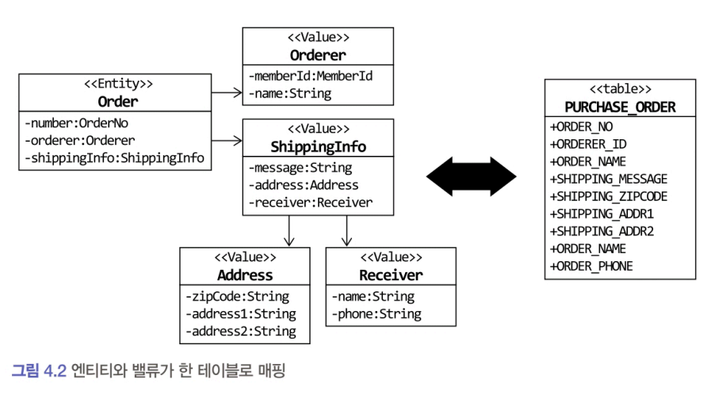

# 4.3.1 엔티티와 밸류 기본 매핑 구현

### 애그리거트와 JPA 매핑을 위한 기본 규칙

- 애그리거트 루트는 엔티티이므로 @Entity로 매핑 설정한다.  
- 한 테이블에 엔티티와 밸류 데이터가 같이 있다면 밸류는@Embeddable로 매핑 설정한다.
    - 밸류 타입 프로퍼티는 @Embedded로 매핑 설정한다.

루트 엔티티와 루트 엔티티에 속한 밸류는 아래 이미지처럼 한 테이블에 매핑할 때가 많다.


### @AttributeOverrides
@Embeddable 타입에 설정한 칼럼 이름과 실제 칼럼 이름이 다르므로 @AttributeOverrides 애너테이션을 이용해서 엔티티 vo의 프로퍼티의 매핑할 칼럼 이름을 변경했다.
```java
@Embeddable
public class ShippingInfo {

    @Embedded
    @AttributeOverrides ({
        @AttributeOverride(name = "zipCode",
                column = @Column(name = "shipping_zipcode")),
        @AttributeOverride(name = "address1",
                column = @Column(name = "shipping_addr1")),
        @AttributeOverride(name = "address2",
                column = @Column(name = "shipping_addr2"))
    })

    private Address address;

    @Column (name = "shipping_message")
    private String message;

    @Embedded
    private Receiver receiver;

    //...
}

@Entity
public class Order {

    @Embedded
    private Orderer orderer;
    
    @Embedded
    private ShippingInfo shippingInfo;
}
```

# 4.3.2 기본 생성자
엔티티와 밸류의 생성자는 객체를 생성할 때 필요한 것을 전달받는다.   

불변 타입이면 생성 시점에 필요한 값을 모두 전달받으므로 값을 변경하는 set 메서드를 제공하지 않는다. 
- 즉 VO 클래스에 기본 생성자(파라미터가 없는)를 추가할 필요가 없다는 것을 의미한다.

그러나 JPA에서 @Entity와 @Embeddable로 클래스를 매핑하려면 기본 생성자를 제공해야 한다. 
- DB에서 데이터를 읽어와 매핑된 객체를 생성할 때 기본 생성자를 사용해서 객체를 생성하기 때문이다.
- 이런 기술적인 제약으로 불변 타입이라 기본 생성자가 필요 없음에도 불구하고 다음과 같이 기본 생성자를 추가해야 한다.

기본 생성자는 JPA 프로바이더가 객체를 생성할 때만 사용한다. 
- 기본 생성자를 다른 코드에서 사용하면 값이 없는 온전하지 못한 객체를 만들게 된다. 
- 이런 이유로 다른 코드에서 기본 생성자를 사용하지 못하도록 protected로 선언한다.

# 4.3.3 필드 접근 방식 사용
### 두 가지 방식 매핑 
JPA는 필드와 메서드 매핑 방식을 제공한다.

#### 메서드 방식
- 프로퍼티를 위한 get/set 메서드를 구현해야 한다.
    - 엔티티에 프로퍼티를 위한 공개 get/set 메서드를 추가하면 도메인의 의도가 사라지고 객체가 아닌 데이터 기반으로 엔티티를 구현할 가능성이 높아진다. 
    - 특히 set 메서드는 내부 데이터를 외부에서 변경할 수 있는 수단이 되기 때문에 캡슐화를 깨는 원인이 될 수 있다.
    - 밸류 타입을 불변으로 구현하려면 set 메서드 자체가 필요 없는데 JPA의 구현 방식 때문에 공개 set 메서드를 추가하는 것도 좋지 않다.

#### 필드 방식
- 엔티티가 객체로서 제 역할을 하려면 외부에 set 메서드 대신 의도가 잘 드러나는 기능을 제공해야 한다. 
    - 상태 변경을 위한 setState() 메서드보다 주문 취소를 위한 cancel () 메서드가 도메인을 더 잘 표현하고, setShippingInfo () 메서드보다 배송지를 변경한다는 의미를 갖는 changeShippingInfo ()가 도메인을 더 잘 표현한다.
- 객체가 제공할 기능 중심으로 엔티티를 구현하게끔 유도하려면, 필드 방식으로 선택해서 불필요한 get/set 메서드를 구현하지 말아야 한다.

#### 하이버네이트 접근 방식
JPA 구현체인 하이버네이트는 @Access를 이용해서 명시적으로 접근 방식을 지정하지 않으면 @ld나 @Embeddedld가 어디에 위치했느냐에 따라 접근 방식을 결정한다.  

- @ld나 @Embeddedld가 필드에 위치하면 필드 접근 방식을 선택하고 get 메서드에 위치하면 메서드 접근 방식을 선택한다.

## 질문
### by. 지은님

> 144p. 마지막 문장  
기능 중심으로 구현하려면 JPA 매핑 처리를 프로퍼티 방식이 아닌 필드 방식으로 선택하라는 것이 무슨 의미일까요?

- 엔티티가 객체로서 제 역할을 하려면 외부에 set 메서드 대신 의도가 잘 드러나는 기능을 제공해야 한다. 는 부분과 연관이 있을 것 같습니다.
- 공개 get/set 메서드를 추가하면 도메인의 의도가 사라지고 객체가 아닌 데이터 기반으로 엔티티를 구현할 가능성이 높아집니다.
    - 이러한 문제들을 해결하기 위해 프로퍼티 방식이 아닌 필드 방식으로 선택하라는 의미인 것 같습니다.