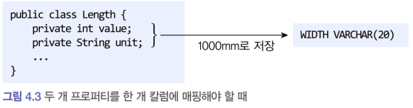
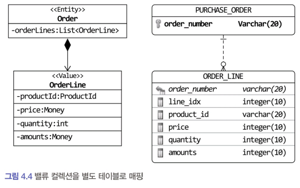

## 4.3.4 AttributeConverter 를 이용한 밸류 매핑 처리


int, long, String, LocalDate와 같은 타입은 DB 테이블의 한 개 칼럼에 매핑된다. 

**밸류 타입의 프로퍼티**를 한 개 칼럼에 매핑해야 할 때도 있다.

- ex. Length: `길이 값` + `단위`의 두 프로퍼티를 한개의 컬럼에 1000mm 같은 형식으로 저장할 수 있다.
  
  - 


두 개 이상의 프로퍼티를 가진 밸류 타입을 한 개 칼럼에 매핑하려면 @Embeddable 애너테이션으로는 처리할 수 없다. 

이럴 때 사용할 수 있는 것이 Attribute Converter이다.

### Attribute Converter

AttributeConverter는 밸류 타입과 칼럼 데이터 간의 변환을 처리하기 위한 기능을 정의한다.

```java
package javax.persistence;
public interface AttributeConverter<X, Y>{

  public Y convertToDatabaseColumn(X attribute);
  
  public X convertToEntityAttribute(Y dbData);
}
```

- 타입 파라미터 X는 밸류 타입이고 Y는 DB 타입이다.
- `convertToDatabaseColumn()`: 밸류 타입을 DB 칼럼 값으로 변환하는 기능을 구현
- `convertToEntityAttribute()`: 메서드는 DB 칼럼 값을 밸류로 변환하는 기능을 구현한다.

- ex. Money 밸류 타입의 AttributeConverter
  ```java
  package com.myshop.common.jpa;
  
  import com.myshop.common.model.Money;
  
  import javax.persistence.AttributeConverter;
  import javax.persistence.Converter;
  
  @Converter(autoApply = true)
  public class MoneyConverter implements AttributeConverter<Money, Integer> {
  
      @Override
      public Integer convertToDatabaseColumn(Money money) {
          return money == null ? null : money.getValue();
      }
  
      @Override
      public Money convertToEntityAttribute(Integer value) {
          return value == null ? null : new Money(value);
      }
  }
  ```
  - `AttributeConverter` 인터페이스를 구현한 클래스는 @Converter 애너테이션을 적용한다.
  - `@Converter` 애너테이션의 `autoApply` 속성값
    - true: 모델에 출현하는 모든 Money 타입의 프로퍼티에 대해 MoneyConverter를 자동으로 적용
        ```java
        @Entity
        @Table(name = "purchase_order")
        public class Order {
        
          @Column(name = "total_amounts")
          private Money totalAmounts; // MoneyConverter를 적용해서 값 자동 변환
        }
        ```
    - false(default): 프로퍼티 값을 변환할 때 사용할 컨버터를 직접 지정해야 한다.
        ```java
        import javax.persistence.Convert;
        public class Order {
        
          @Column(name = "totalamounts")
          @Convert(converter = MoneyConverter.class)
          private Money totalAmounts;
        }
        ```
      
## 4.3.5 밸류 컬렉션: 별도 테이블 매핑

- Order 엔티티는 한 개 이상의 OrderLine을 가질 수 있다. 
- OrderLine에 순서가 있다면 다음과 같이 List 타입을 이용해서 컬렉션을 프로퍼티로 지정할 수 있다.

```java
public class Order {

  private List OrderLine>orderLines;
}
```

### Order와 OrderLine을 저장하기 위한 테이블
- 

#### PURCHASE_ORDER 테이블 (Order 엔티티 매핑) 
| 컬럼명           | 타입          |
|---------------|-------------|
| order\_number | varchar(20) |

#### ORDER_LINE 테이블 (OrderLine 값 객체 매핑)
| 컬럼명           | 타입          | 설명                         |
|---------------|-------------|----------------------------|
| order\_number | varchar(20) | `PURCHASE_ORDER` 테이블의 외부 키 |
| line\_idx     | integer(10) | `List<OrderLine>`의 인덱스     |
| product\_id   | varchar(20) | 제품 ID                      |
| price         | integer(10) | 가격                         |
| quantity      | integer(10) | 수량                         |
| amounts       | integer(10) | 총 금액                       |

- 밸류 컬렉션을 저장하는 ORDER_LINE 테이블
- 엔티티에 해당하는 PURCHASE ORDER 테이블을 외래키로 참조
  - 여기서 외부키는 컬렉션이 속할 엔티티를 의미
- line_idx를 통해 List 컬렉션의 순서를 유지


### JPA 매핑 코드
- JPA에서는 밸류 컬렉션(value collection)을 별도 테이블로 매핑하기 위해 `@ElementCollection`과 `@CollectionTable` 을 사용한다.

#### Order 엔티티
```java
@Entity
@Table(name = "purchase_order")
public class Order {

    @EmbeddedId
    private OrderNo number;

    @ElementCollection(fetch = FetchType.EAGER)
    @CollectionTable(
        name = "order_line",
        joinColumns = @JoinColumn(name = "order_number")
    )
    @OrderColumn(name = "line_idx")
    private List<OrderLine> orderLines;

}
```

#### OrderLine 값 객체
```java
@Embeddable
public class OrderLine {

    @Embedded
    private ProductId productId;

    @Column(name = "price")
    private Money price;

    @Column(name = "quantity")
    private int quantity;

    @Column(name = "amounts")
    private Money amounts;

}
```
- `OrderLine`은 값 객체이므로 `@Entity`가 아니라 `@Embeddable`로 정의해야 한다.
- `OrderLine` 내부에는 `line_idx` 인덱스 값을 위한 프로퍼티가 필요 없다. `List` 컬렉션의 인덱스를 JPA가 자동 관리하기 때문이다.

### 주요 애너테이션 설명
- `@ElementCollection`
  - 값 타입 컬렉션 매핑 시 사용
  - 기본적으로 지연 로딩이지만, 예제에서는 `FetchType.EAGER`로 즉시 로딩
- `@CollectionTable`
  - 컬렉션 데이터를 저장할 별도의 테이블 지정
  - 속성
    - `name`: 테이블 이름
    - `joinColumns`: 외래키로 사용할 컬럼 지정 (@JoinColumn 사용)
      - 외래 키가 두 개 이상인 경우 `@JoinColumn`의 배열을 이용해서 외부키 목록을 지정
- `@OrderColumn`
  - 컬렉션 순서를 보장하기 위해 인덱스를 저장할 컬럼 지정
  - `line_idx` 컬럼에 리스트 인덱스가 자동 저장

#### 예제: 외래 키가 두 개 이상인 경우 `@JoinColumn`의 배열을 이용해서 외부키 목록을 지정

```java
@Embeddable
public class OrderId implements Serializable {

    @Column(name = "order_number")
    private String orderNumber;

    @Column(name = "customer_id")
    private String customerId;

}
```

```java
@Entity
@Table(name = "purchase_order")
public class Order {

    @EmbeddedId
    private OrderId id;

    @ElementCollection(fetch = FetchType.EAGER)
    @CollectionTable(
        name = "order_line",
        joinColumns = {
            @JoinColumn(name = "order_number", referencedColumnName = "order_number"),
            @JoinColumn(name = "customer_id", referencedColumnName = "customer_id")
        }
    )
    @OrderColumn(name = "line_idx")
    private List<OrderLine> orderLines;

}
```

```java
@Embeddable
public class OrderLine {

    @Embedded
    private ProductId productId;

    @Column(name = "price")
    private Money price;

    @Column(name = "quantity")
    private int quantity;

    @Column(name = "amounts")
    private Money amounts;

}
```