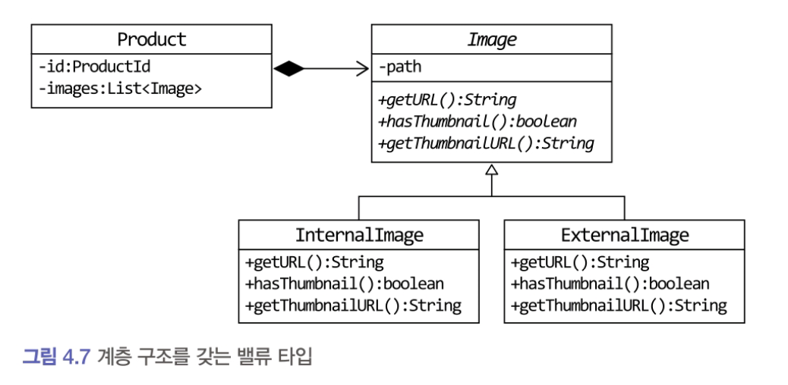
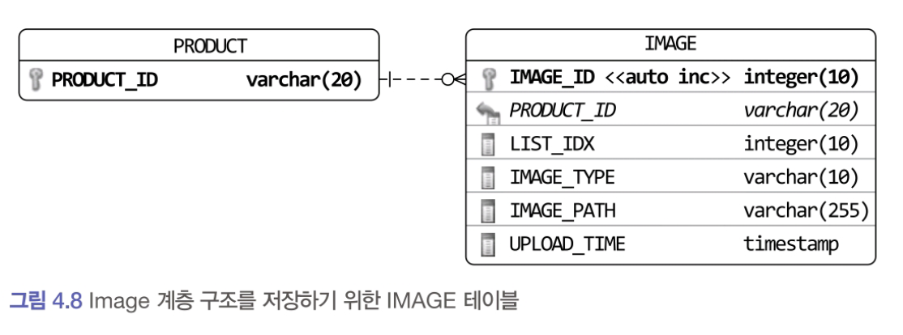

# 4.3.9 밸류 컬렉션을 `@Entity` 로 매핑하기

개념적으로 밸류인데 구현 기술의 한계나 팀 표준 때문에 `@Entity` 를 사용해야 할 때도 있다.

###  제품의 이미지 업로드 방식에 따라 이미지 경로, 썸네일 이미지 제공 여부가 달라지는 경우



- JPA는 `@Embeddable` 타입의 클래스 상속 매핑을 지원하지 않는다. (구현 기술의 한계)
- 상속 구조를 갖는 밸류 타입을 사용하려면  `@Embeddable` 대신 `@Entity` 를 이용해서 상속 매핑으로 처리해야 한다.
- 밸류 타입을 `@Entity` 로 매핑하므로 식별자 매핑을 위한 필드도 추가해야 한다. (기본키)
- 구현 클래스를 구분 하기 위한 타입 식별(discriminator) 컬럼을 추가해야한다.

##### Image 계층 구조를 저장하기 위한 테이블


- 한 테이블에 Image와 그 하위클래스 (Internal- , External-) 를 매핑하므로 Image 클래스에 다음 설정을 사용한다.
    - `@Inheritance` 애너테이션 적용
    - statrategy 값으로 `SINGLE_TABLE` 사용
    - `@DiscriminatorColumn` 애너테이션을 이용하여 타입 구분용으로 사용할 칼럼 지정

>`@Inheritance`  <br> JPA에서 **엔티티 상속 구조를 데이터베이스 테이블에 어떻게 매핑할지를 지정하는 어노테이션**.  <br>
>부모 엔티티와 자식 엔티티가 있을 때, `strategy`를 통해 이를 어떤 방식으로 테이블에 나눌지를 결정할 수 있으며,  대표 전략에는 `SINGLE_TABLE`, `JOINED`, `TABLE_PER_CLASS`가 있다.


Image를 `@Entity` 로 매핑했지만 모델에서 Image 는 밸류이므로 상태를 변경하는 기능은 추가하지 않는다.

```java

import javax.persistence.*;
import java.util.Date;

@Entity
@Inheritance(strategy = InheritanceType.SINGLE_TABLE)
@DiscriminatorColumn(name = "image_type")
@Table(name = "image")
public abstract class Image {

    @Id
    @GeneratedValue(strategy = GenerationType.IDENTITY)
    @Column(name = "image_id")
    private Long id;

    @Column(name = "image_path")
    private String path;

    @Temporal(TemporalType.TIMESTAMP)
    @Column(name = "upload_time")
    private Date uploadTime;

    protected Image() {}

    public Image(String path) {
        this.path = path;
        this.uploadTime = new Date();
    }

    protected String getPath() {
        return path;
    }

    public Date getUploadTime() {
        return uploadTime;
    }

    public abstract String getURL();
    public abstract boolean hasThumbnail();
    public abstract String getThumbnailURL();
}
```

Image를 상속받은 클래스는 @Entity 와 @Discriminator를 사용해서 매핑을 설정한다.

```java
@Entity
@DiscriminatorValue("II")
public class InternalImage extends Image {
    // 구현 생략
}

@Entity
@DiscriminatorValue("EI")
public class ExternalImage extends Image {
    // 구현 생략
}
```

Image 가 @Entity 이므로 목록을 담고 있는 Product는 `OneToMany` 를 이용해서 매핑을 처리한다.
Image는 밸류이므로 독자적인 라이프 사이클을 갖지 않고 Product에 완전히 의존한다. (생명주기가 완전히 동일하다.)
따라서 Product를 저장할 때 함께 저장하고 Product를 삭제할 때 함께 삭제되도록 cascade 속성을 지정한다.
리스트에서 Image 객체를 제거하면 DB에서 함께 삭제되도록 orphanRemoval도 true로 설정한다. (부모 엔티티와의 연관관계가 끊긴 자식 엔티티를 데이터베이스에서도 자동으로 삭제)

```java
@Entity
@Table(name = "product")
public class Product {

    @EmbeddedId
    private ProductId id;

    private String name;

    @Convert(converter = MoneyConverter.class)
    private Money price;

    private String detail;

    @OneToMany(
        cascade = {CascadeType.PERSIST, CascadeType.REMOVE},//생명주기 동일
        orphanRemoval = true //리스트에서 삭제된 이미지를 테이블에서 삭제
    )
    @JoinColumn(name = "product_id")
    @OrderColumn(name = "list_idx")
    private List<Image> images = new ArrayList<>();

    // ...

    public void changeImages(List<Image> newImages) {
        images.clear();
        images.addAll(newImages);
    }
}
```

```java
    public void changeImages(List<Image> newImages) {
        images.clear(); // 클리어시 delete 메서드 동작 (컬렉션의 요소 수만큼)
        images.addAll(newImages);
    }
```

위의 `changeImages()` 메서드를 보면 이미지 교체를 위해 `clear()` 메서드를 사용하고 있다.
`@Entity`에 대한 `@OneToMany` 매핑에서 컬렉션의 `clear()` 메서드를 호출하면 삭제 과정이 효율적이지는 않다.

엔티티를 위한 컬렉션 객체의 `clear()` 메서드를 호출하면
1.  select 쿼리로 대상 엔티티를 로딩하고,
2. 각 개별 엔티티에 대해 delete 쿼리를 실행한다.
   즉, images에 보관된 image 개수가 4개면  **image 목록**을 가져오기 위한
- 한번의 `select * from image where product_id = ?` 쿼리와
- 각 image를 삭제하기 위한 네 번의 `delete from image where image_id = ?` 쿼리를 실행한다

변경 빈도가 낮으면 괜찮지만 빈도가 높으면 **전체 성능에 문제가 될 수 있다**

하이버네이트는 `@Embeddable` 타입에 대한 컬렉션의 clear() 메서드를 호출하면 컬렉션에 속한 객체를 로딩하지 않고 한 번의 delete 쿼리로 삭제 처리를 수행한다.
```sql
DELETE FROM images WHERE product_id = ?
```

따라서 애그리거트의 특성을 유지하면서 이 문제를 해소하려면 결국 **상속을 포기하고** @Embeddable 로 매핑된 단일 클래스로 구현해야 한다.
물론 타입에 따라 다른 기능을 구현하려면 if-else 를 써야한다.

```java
@Embeddable
public class Image {

    @Column(name = "image_type")
    private String imageType;

    @Column(name = "image_path")
    private String path;

    @Temporal(TemporalType.TIMESTAMP)
    @Column(name = "upload_time")
    private Date uploadTime;

    // ...

    public boolean hasThumbnail() {
        // 성능을 위해 다형성을 포기하고 if-else로 구현
        if (imageType.equals("II")) {
            return true;
        } else {
            return false;
        }
    }
}

```

코드 유지 보수와 성능의 두 가지 측면을 고려해서 구현 방식을 선택해야 한다.

# 4.3.10 ID 참조와 조인 테이블을 이용한 단방향 M-N 매핑

3장에서 애그리거트 간 집합 연관은 성능 상의 이유로 피해야 한다고 했다.
그럼에도 불구하고 요구사항을 구현하는 데 집합 연관을 사용하는 것이 유리하다면 ID 참조를 이용한 단방향 집합 연관을 적용해 볼 수 있다.

```java
@Entity
@Table(name = "product")
public class Product {

    @EmbeddedId
    private ProductId id;

    @ElementCollection
    @CollectionTable(
        name = "product_category",
        joinColumns = @JoinColumn(name = "product_id")
    )
    private Set<CategoryId> categoryIds;

    // ...
}

```

이 코드는 Product에서 Category 로의 단방향 M-N 연관을 **ID 참조**방식으로 구현한 것이다.<br>
ID 참조를 이용한 애그리거트 간 단방향 M-N 연관은 **밸류 컬렉션 매핑과 동일한 방식으로 설정**한 것을 알 수 있다.<br>
차이점이 있다면 집합의 값에 밸류 대신 **연관을 맺는 식별자**가 온다는 점이다<br>
`@ElementCollection` 을 이용하기 때문에 Product를 삭제할 때 사용한 조인 테이블의 데이터도 함께 삭제된다. 애그리거트를 직접 참조하는 방식을 사용했다면 영속성 전파 (cascade) 나 로딩 전략을 고민해야 하는데 ID 참조 방식을 사용함으로써 이런 고민을 없앨 수 있다.