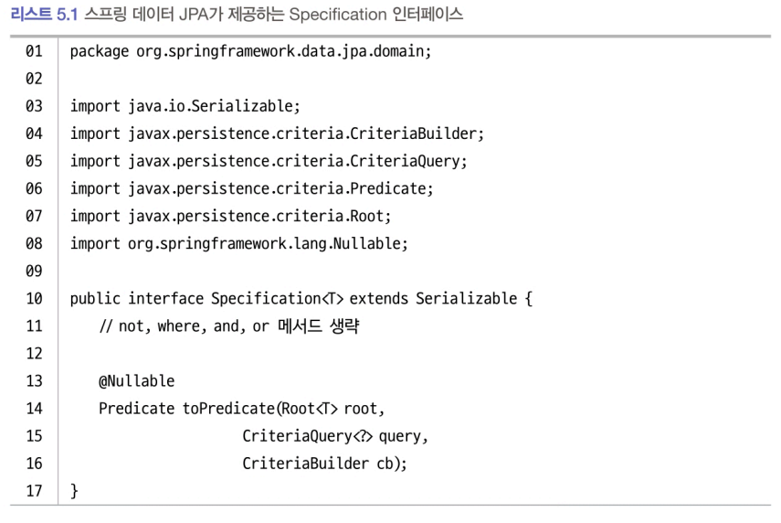
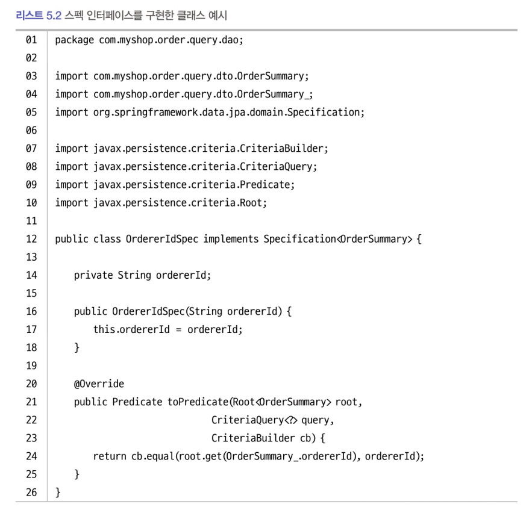
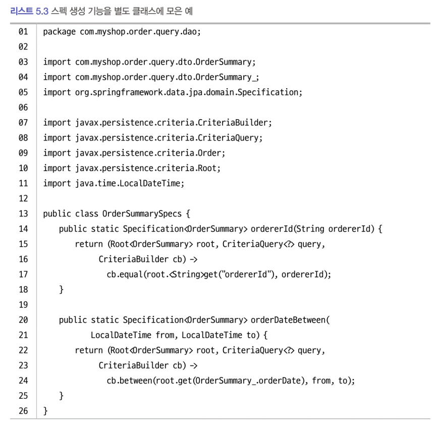

# 5.3 스프링 데이터 JPA를 이용한 스펙 구현

- 스프링 데이터 JPA는 검색 조건을 표현하기 위한 인터페이스인 Specification을 제공하며 아래와 같이 정의한다.


- 스펙 인터페이스에서 지네릭 타입 파라미터 T는 JPA 엔티티 타입을 의미한다. 
- toPredicate() 메서드는 JPA 크리테리아 Criteria API에서 조건을 표현하는 Predicate을 생성한다.

### 예시
- 엔티티 타입:  OrderSummary다.
- ordererld 프로터티 값이 지정한 값과 동일한 조건


- OrdererldSpec 클래스는 Specification OrderSummary> 타입을 구현하므로 OrderSummary에 대한 검색 조건을 표현한다. 
- toPredicate() 메서드를 구현한 코드는 “ordererld" 프로퍼티 값이 생성자로 전달받은 ordererId와 동일한지 비교하는 Predicate을 생성한다.

## JPA 정적 메타 모델
OrderSummary_ordererld 코드의 OrderSummary_ 클래스는 JPA 정적 메타 모델을 정의한 코드이다.   
정적 메타 모델 클래스는 아래와 같이 구현한다.

```java
@StaticMetamodel(OrderSummary.class)
public class OrderSummary_ {

    public static volatile SingularAttribute<OrderSummary, String> number;
    public static volatile SingularAttributeOrderSummary, Long> version;
    public static volatile SingularAttribute OrderSummary, String> ordererId;
    public static volatile SingularAttribute<OrderSummary, String> ordererName;
    //... 생략
}
```
- 정적 메타 모델은 @StaticMetamodel 애너테이션을 이용해서 관련 모델을 지정한다. 
- 메타 모델 클래스는 모델 클래스의 이름 뒤에 '_'을 붙인 이름을 갖는다.
- 정적 메타 모델 클래스는 대상 모델의 각 프로퍼티와 동일한 이름을 갖는 정적 필드를 정의한다. 
    - 정적 필드는 프로퍼티에 대한 메타 모델로서 프로퍼티 타입에 따라 SingularAttribute, ListAttribute 등의 타입을 사용해서 메타 모델을 정의한다.
    - 정적 메타 모델을 사용하는 대신 문자열로 프로퍼티를 지정할 수도 있다. 
        - toPredicate() 메소드를 문자열을 이용해서 아래와 같이 구현할 수도 있다.
        > cb.equal(root.String>get("ordererId"), ordererId)
        - 하지만 문자열은 오타 가능성이 있고 실행하기 전까지는 오타가 있다는 것을 놓치기 쉽다. 
        - 게다가 IDE의 코드 자동 완성 기능을 사용할 수 없어 입력할 코드도 많아진다. 
        - 이런 이유로 Criteria를 사용할 때에는 정적 메타 모델 클래스를 사용하는 것이 코드 안정성이나 생산성 측면에서 유리하다.
- 정적 메타 모델 클래스를 직접 작성할 수 있지만 하이버네이트와 같은 JPA 프로바이더는 정적 메타 모델을 생성하는 도구를제공하고 있으므로 이들 도구를 사용한다.
- 스펙 구현 클래스를 개별적으로 만들지 않고 별도 클래스에 스펙 생성 기능을 모아도 된다. 예를 들어 OrderSummary와 관련된 스펙 생성 기능을 아래와 같이 한 클래스에 모을 수 있다.


    - 스펙 인터페이스는 함수형 인터페이스이므로 람다식을 이용해서 객체를 생성할 수 있다. 
    - 스펙 생성이 필요한 코드는 스펙 생성 기능을 제공하는 클래스를 이용해서 조금 더 간결하게 스펙을 생성할 수 있다.
    ```java
    Specification OrderSummary> betweenSpec = OrderSummarySpecs.orderDateBetween(from, to);
    ```