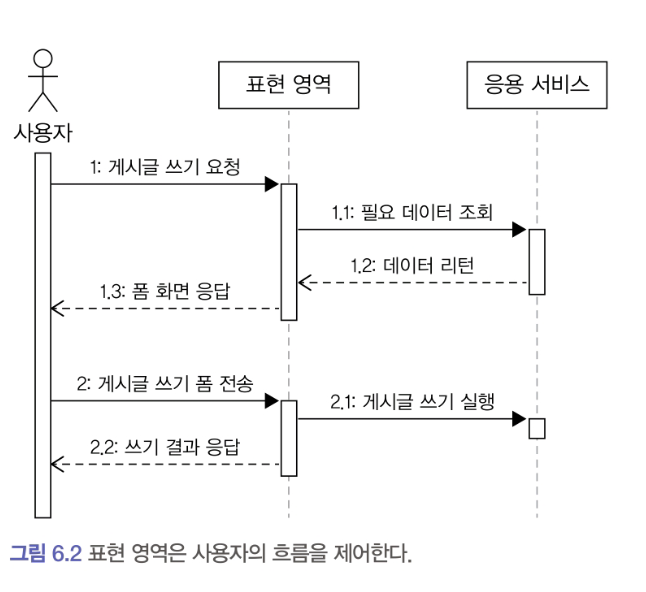

# 6.4 표현 영역

## 표현 영역의 책임은 다음과 같다.

- 사용자가 시스템을 사용할 수 있는 흐름(화면) 제공 및 제어
- 사용자의 요청을 알맞은 응용 서비스에 전달 및 결과를 사용자에게 결과 제공
- 사용자의 세션 관리


###  사용자가 시스템을 사용할 수 있는 흐름(화면) 제공 및 제어

웹 서비스의 표현 영역은 사용자가 요청한 내용을 응답으로 제공한다.
응답에는 다음 화면으로 이동할 수 있는 링크나 데이터를 입력하는 데 필요한 폼 등이 포함된다.

- 웹 애플리케이션에서 사용자가 게시글 쓰기를 표현 영역에 요청한 경우
  
  1. 사용자는 표현 영역이 제공한 폼에 알맞은 값을 입력하고 다시 폼을 표현 영역에 전송한다.
  2. 표현 영역은 응용 서비스를 이용해서 표현 영역의 요청을 처리하고 그 결과를 응답으로 전송한다.

### 사용자의 요청에 맞게 응용 서비스에 기능 실행 요청

표현 영역은 화면을 보여주는데 필요한 데이터를 읽거나 도메인의 상태를 변경해야 할때 응용 서비스를 사용한다.
이 과정에서 표현 영역은 사용자의 요청 데이터를 응용 서비스가 요구하는 형식으로 변환하고 응용 서비스의 결과를 사용자에게 응답할 수 있는 형식으로 변환한다.

- 암호 변경을 처리하는 표현 영역
  ```java
  @PostMapping()
  public String changePassword(HttpServletRequest request, Errors errors) {
      // 표현 영역은 사용자 요청(HTTP 요청 파라미터)을 응용 서비스가 요구하는 형식으로 변환한다.
      String curPw = request.getParameter("curPw");
      String newPw = request.getParameter("newPw");
      String memberId = SecurityContext.getAuthentication().getId();
      ChangePasswordRequest chPwdReq =
          new ChangePasswordRequest(memberId, curPw, newPw);
  
      try {
          // 응용 서비스를 실행
          changePasswordService.changePassword(chPwdReq);
          return successView;
      } catch (BadPasswordException | NoMemberException ex) {
          // 응용 서비스의 처리 결과를 알맞은 응답으로 변환
          errors.reject("idPasswordNotMatch");
          return formView;
      }
  }
  
  ```
- MVC 프레임워크는 HTTP 요청 파라미터로부터 자바 객체를 생성하는 기능을 지원하므로, 이 기능을 사용하면 응용 서비스에 전달할 자바 객체를 손쉽게 생성할 수 있다.
  ```java
  // 프레임워크가 제공하는 기능을 사용해서
  // HTTP 요청을 응용 서비스의 입력으로 쉽게 변경 처리
  @PostMapping
  public String changePassword(ChangePasswordRequest chPwdReq, Errors errors) {
      String memberId = SecurityContext.getAuthentication().getId();
      chPwdReq.setMemberId(memberId);
  
      try {
          changePasswordService.changePassword(chPwdReq);
          return successView;
      } catch (BadPasswordException | NoMemberException ex) {
          // 응용 서비스의 처리 결과를 알맞은 응답으로 변환
          errors.reject("idPasswordNotMatch");
          return formView;
      }
  }
  
  ```
    - 응용 서비스의 실행 결과를 사용자에게 알맞은 형식으로 제공하는 것도 표현 영역의 몫이다.
    - 이 코드는 예외가 발생하면 에러코드 `idPasswordNotMatch` 를 설정하는데, 표현 영역의 뷰는 이 에러코드에 알맞은 처리(해당 하는 메시지 출력 등)를 하게 된다.

### 사용자의 세션 관리

웹은 쿠키나 서버 세션을 이용해서 사용자의 연결 상태를 관리한다.
세션 관리는 권한 검사와도 연결되는데 이에 대한 내용은 뒤에서 다시 다룬다.