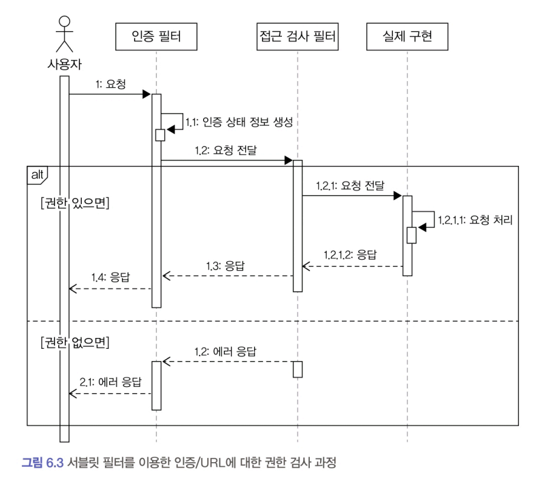
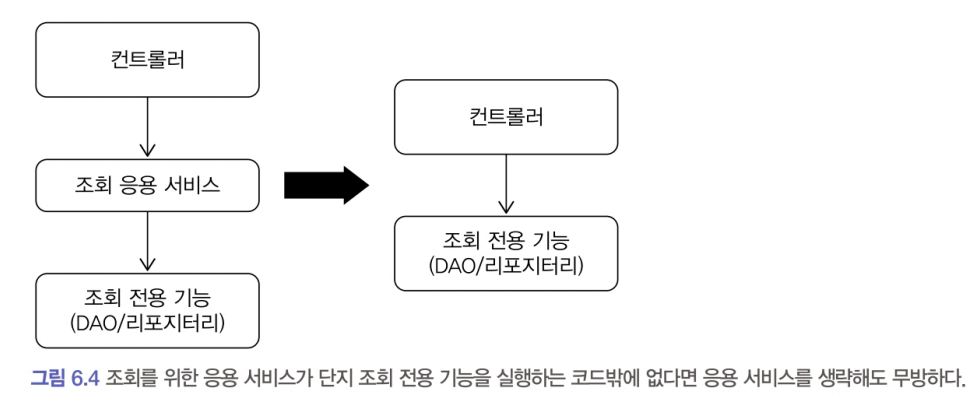

# 6.6 권한 검사
### 권한 검사
- '사용자 U가 기능 F를 실행할 수 있는지 확인하는 것
- 그러나 개발하는 시스템마다 권한의 복잡도가 다르다. 
    - 단순한 시스템은 인증 여부만 검사
    - 복잡한 시스템은 관리자인지에 따라 사용할 수 있는 기능이 다르거나 실행할 수 있는 기능이 역할마다 달라지는 경우

### 스프링 시큐리티Spring Security
- 복잡한 경우에 대응하기 위해 유연하고 확장 가능한 구조
    - 유연한 만큼 복잡하다는 것을 의미 
- 보안 프레임워크에 대한 이해가 부족하면 프레임워크를 무턱대고 도입하는 것보다 개발할 시스템에 맞는 권한 검사 기능을 구현하는 것이 시스템 유지 보수에 유리할 수 있다.

## 권한 검사 수행 위치
- 표현 영역
- 응용 서비스
- 도메인

### 표현 영역
- 인증된 사용자인지 아닌지 검사 수행
    - URL을 처리하는 컨트롤러에 웹 요청을 전달하기 전에 인증 여부를 검사해서 인증된 사용자의 웹 요청만 컨트롤러에 전달
    - 인증된 사용자가 아닐 경우 로그인 화면으로 리다이렉트Redirect

#### 서블릿 필터Servlet Filter 
- 접근 제어를 하기에 좋은 위치 
- 서블릿 필터에서 사용자의 인증 정보를 생성하고 인증 여부를 검사
    - 인증된 사용자면 다음 과정을 진행하고 그렇지 않으면 로그인 화면이나 에러 화면 전달
- 인증 여부뿐만 아니라 권한에 대해서 동일한 방식으로 필터를 사용해서 URL별 권한 검사 수행 
- 스프링 시큐리티는 이와 유사한 방식으로 필터를 이용해서 인증 정보를 생성하고 웹 접근 제어 수행



### 응용 서비스
- URL 만으로 접근 제어를 할 수 없는 경우 응용 서비스의 메서드 단위로 권한 검사를 수행 
- 스프링 시큐리티 활용시,  AOP를 이용해서 애너테이션으로 서비스 메서드에 대한 권한 검사를 할 수 있는 기능을 제공
```java
public class BlockMemberService {

    private MemberRepository memberRepository;
    
    @PreAuthorize("hasRole('ADMIN')")
    public void block(String memberId) {
        Member member = memberRepository.findById (memberId);
        if (member == null) throw new NoMemberException();
        member.block();
    }

```

### 도메인
- 개별 도메인 객체 단위로 권한 검사를 해야 하는 경우는 구현이 복잡하다.

#### 예시 - 게시글 삭제는 본인 또는 관리자 역할을 가진 사용자만 할 수 있는 경우
- 게시글 작성자가 본인인지 확인하려면 게시글 애그리거트를 먼저 로딩해야 한다. 
    - 즉 응용 서비스의 메서드 수준에서 권한 검사를 할 수 없기 때문에 직접 권한 검사 로직을 구현해야 한다.
    - permissionService.checkDeletePermission()은 파라미터로 전달받은 사용자 ID와 게시글을 이용해서 삭제 권한을 가졌는지를 검사 수행
```java
public class DeleteArticleService {
    
    public void delete(String userId, Long articleId) {
        Article article = articleRepository.findById(articleId);
        checkArticleExistence(article);
        permissionService.checkDeletePermission(userId, article);
        article.markDeleted();
    }
```

- 스프링 시큐리티와 같은 보안 프레임워크를 확장해서 개별 도메인 객체 수준의 권한 검사 기능을 프레임워크에 통합할 수도 있다. 
    - 도메인 객체 수준의 권한 검사 로직은 도메인별로 다르므로 도메인에 맞게 보안 프레임워크를 확장하려면 프레임워크에 대한 높은 이해가 필요
    - 이해도가 높지 않아 프레임워크 확장을 원하는 수준으로 할 수 없다면 프레임워크를 사용하는 대신 도메인에 맞는 권한 검사 기능을 직접 구현하는 것이 코드 유지 보수에 유리

# 6.7 조회 전용 기능과 응용 서비스
- 서비스에서 수행하는 추가적인 로직이 없고 단일 쿼리만 실행하는 조회 전용 기능
    - 트랜잭션이 필요하지 않다.
    - 이런 경우 표현 영역에서 바로 조회 전용 기능을 사용해도 문제가 없다.
```java
public class OrderController {
    private OrderViewDao orderViewDao;

    @RequestMapping ("/myorders")
    public String list(ModelMap model) {
        String ordererId = SecurityContext.getAuthentication().getId();
        List OrderView> orders = orderViewDao.selectBy0rderer(ordererId);
        model.addAttribute("orders", orders);
        return "order/list";
    }
```
- 응용 서비스가 사용자 요청 기능을 실행하는 데 별다른 기여를 하지 못한다면 굳이 서비스를 만들지 않아도 된다.
