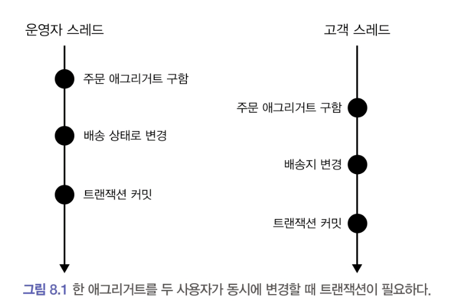
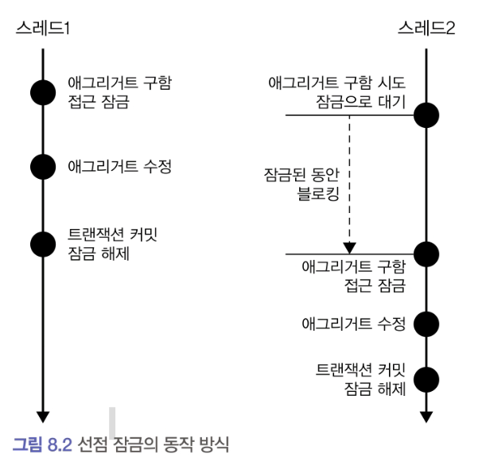

# 8.1 애그리거트와 트랜잭션

한 주문 애그리거트에 대해
- 운영자가 먼저 배송 상태로 변경
- 운영자 트랜잭션 커밋 전에 사용자가 배송지 주소를 변경

#### 동시성 이슈가 발생할 수 있는 상황


- 트랜잭션 마다 리포지토리는 새로운 애그리거트 객체를 생성하므로 운영자 스레드와 고객 스레드는 **같은 주문 애그리거트** 를 나타내는 **다른 객체**를 구하게 된다.
- 운영자 스레드와 고객 스레드는 개념적으로 동일한 애그리거트지만 물리적으로 서로 다른 애그리거트 객체를 사용한다.
    - 때문에 운영자 스레드가 먼저 애그리거트 객체를 배송 상태로 변경 하더라도 고객 스레드가 사용하는 주문 애그리거트 객체에는 영향을 주지 않는다.
    - 고객 스레드 입장에서 주문 애그리거트 객체는 아직 배송 상태 전이므로 배송지 정보를 변경할 수 있다.

이 상황에서 두 스레드는 각 트랜잭션을 커밋할 때 수정한 내용을 DB에 반영한다.
- 운영자 스레드 커밋 시점에 배송 상태로 변경
- 고객 스레드 커밋 시점에 배송 상태 롤백, 배송지 변경

이 순서의 문제점은 운영자는 기존 배송지 정보를 이용해서 배송 상태로 변경했는데, 그 사이 고객은 배송지 정보를 변경했다는 점이다.
- 배송 상태인 주문은 배송지를 수정할 수 없다는 일관성이 깨져버린다.

#### 일관성이 깨지는 문제가 발생하지 않도록 하려면
- 운영자가 배송지 정보를 조회하고 상태를 변경하는 동안 고객이 애그리거트를 수정하지 못하게 막는다.
- 운영자가 배송지 정보를 조회한 이후에 고객이 정보를 변경하면, 운영자가 애그리거트를 다시 조회한 뒤 수정하도록 한다.

이 두 가지는 애그리거트 자체의 트랜잭션과 관련이 있다. DBMS가  지원하는 트랜잭션과 함께 추가적인 트랜잭션 처리 기법이 필요하다.
- 선점 잠금 (Pessimistic Lock, 비관적 락)
- 비선점 잠금 (Optimistic Lock, 낙관적 락)


# 8.2 선점 잠금

선점 잠금은 먼저 애그리거트를 구한 스레드가 애그리거트 사용이 끝날 때까지 다른 스레드가 해당 애그리거트를 수정하지 못하게 막는 방식이다.

#### 선점 잠금의 동작 방식




- 스레드 1이 선점 잠금 방식으로 애그리거트를 구한다
- 스레드 2가 같은 애그리거트를 구하려고 한다.
    - 이때 스레드 1는 스레드 1이 애그리거트에 대한 잠금을 해제할 때 까지 blocking 된다. (제어권이 dbms에 있는 상태)
- 스레드 1이 애그리거트를 수정하고 트랜잭션을 커밋하며 잠금을 해제한다.
- 이 순간 대기하고 있던 스레드 2가 애그리거트에 접근한다.
    - 스레드 1이 트랜잭션을 커밋한 뒤에 스레드 2가 애그리거트를 구하게 되므로 스레드2는 스레드1이 수정한 애그리거트의 내용을 보게 된다.


> 한 스레드가 애그리거트를 구하고 수정하는 동안 다른 스레드가 수정할 수 없으므로 동시에 애그리거트를 수정할 때 발생하는 데이터 충돌 문제를 해소할 수 있다.

#### 주문의 동시성 문제에 선점 잠금 적용


- 운영자 스레드가 먼저 선점 잠금 방식으로 주문 애그리거트를 구한다.
    - 운영자 스레드가 잠금을 해제할 때까지 고객 스레드는 대기 상태가 된다.
- 운영자 스레드가 배송 상태로 변경한 뒤 트랜잭션을 커밋 하면 잠금을 해제한다.
- 이후 고객 스레드가 구하는 주문 애그리거트는 운영자 스레드가 수정한 배송 상태의 주문 애그리거트다.
- 배송 상태이므로 주문 애그리거트는 배송지 변경 시 에러를 발생하고 트랜잭션은 실패하게 된다.
    - 이 시점에 고객은 `이미 배송이 시작되어 배송지를 변경할 수 없습니다` 와 같은 안내 문구를 보게 된다.

> 선점 잠금은 보통 DBMS가 제공하는 행단위 잠금을 사용해서 구현한다. 대부분의 DBMS가 for update 와 같은 쿼리를 사용해서 특정 레코드에 한 커넥션만 접근할 수 있는 잠금장치를 제공한다.

### JPA 의 LockModeType

#### EntityManager
- JPA의 엔티티매니저는 LockModeType을 인자로 받는 find() 메서드를 제공한다.
- LockModeType.PESSIMISTIC_WRITE를 값으로 전달하면 해당 엔티티와 매핑된 테이블을 이용해서 선점 잠금 방식을 적용할 수 있다.

```java
Order order = entityManager.find(
    Order.class, orderNo, LockModeType.PESSIMISTIC_WRITE
);
```

JPA 프로바이더 (hibernate 등)와 DBMS에 따라 잠금 모드 구현이 다르다. 하이버네이트의 경우 `PESSIMISTIC_WRITE`를 잠금 모드로 사용하면 `for update` 쿼리를  이용해서 선점 잠금을 구현한다.

스프링 데이터 JPA는 `@Lock` 애너테이션을 사용해서 잠금 모드를 지정한다.

```java
import org.springframework.data.jpa.repository.Lock;
import javax.persistence.LockModeType;

public interface MemberRepository extends Repository<Member, MemberId> {

    @Lock(LockModeType.PESSIMISTIC_WRITE)
    @Query("select m from Member m where m.id = :id")
    Optional<Member> findByIdForUpdate(@Param("id") MemberId memberId);
}
```

## 8.2.1 선점 잠금과 교착 상태

선점 잠금 기능을 사용할 때는 잠금 순서에 따른 교착상태 (deadlock) 가 발생하지 않도록 주의 해야 한다.

- 스레드1: A 애그리거트에 대한 선점 잠금 구함
- 스레드2: B애그리거트에 대한 선점 잠금 구함
- 스레드1: B애그리거트에 대한 선점 잠금 시도
- 스레드2: A애그리거트에 대한 선점 잠금 시도

이 순서에 따르면 스레드1은 영원히 B 애그리거트에 대한 선점 잠금을 구할 수 없다.  스레드 2가 B 애그리거트에 대한 잠금을 이미 선점하고 있기 때문이다.

동일한 이유로 스레드2는 A애그리거트에 대한 잠금을 구할 수 없다.
두 스레드는 상대방 스레드가 먼저 선점한 잠금을 구할 수 없어 더 이상 다음 단계를 진행하지 못하게 된다.

즉 스레드 1과 스레드 2는 교착상태에 빠진다.

이런 문제가 발생하지 않도록 하려면 잠금을 구할 때 **최대 대기 시간**을 지정해야 한다. JPA에서 선점 잠금을 시도할 때 최대 대기 시간을 지정하려면 다음과 같이 힌트를 사용한다.

```java
Map<String, Object> hints = new HashMap<>();
//3.x 이상 + Hibernate 6.x 부터는 Jakarta EE 9 기반이므로 `jakarta.persistence.*` 를 사용해야함
hints.put("javax.persistence.lock.timeout", 2000);

Order order = entityManager.find(
    Order.class, orderNo, LockModeType.PESSIMISTIC_WRITE, hints);
```

JPA의 `javax.persistence.lock.timeout` 힌트는 잠금을 구하는 대기 시간을 밀리초 단위로 지정한다. 지정한 시간 이내에 잠금을 구하지 못하면 익셉션을 발생시킨다.

스프링 데이터 JPA는 `@QueryHints` 애너테이션을 사용해서 쿼리 힌트를 지정할 수 있다.

```java
import org.springframework.data.jpa.repository.Lock;
import org.springframework.data.jpa.repository.QueryHints;
import javax.persistence.QueryHint;
import javax.persistence.LockModeType;

public interface MemberRepository extends Repository<Member, MemberId> {

    @Lock(LockModeType.PESSIMISTIC_WRITE)
    @QueryHints({
        @QueryHint(name = "javax.persistence.lock.timeout", value = "2000")
    })
    @Query("select m from Member m where m.id = :id")
    Optional<Member> findByIdForUpdate(@Param("id") MemberId memberId);
}
```

> 이 힌트를 사용할 때 주의할 점은 DBMS에 따라 힌트가 적용되지 않을 수도 있다는 것이다. 힌트를 이용할 때에는 사용 중인 DBMS가 관련 기능을 지원하는지 확인해야 한다.
>
> DBMS에 따라 교착 상태에 빠진 커넥션을 처리하는 방식이 다르다. 쿼리별로 대기 시간을 지정할 수 있는 DBMS가 있고, 커넥션 단위로만 대기 시간을 지정할 수 있는 DBMS도 있다.
>
> 따라서 선점 잠금을 사용하려면 사용하는 DBMS에 대해 JPA가 어떤 식으로 대기 시간을 처리하는지 반드시 확인해야 한다.