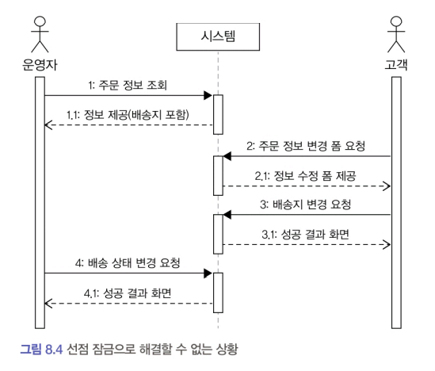
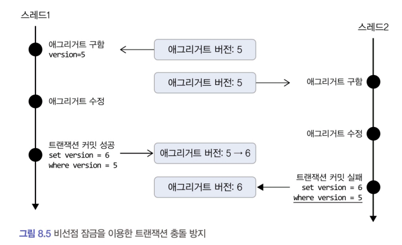

# 8.3 비선점 잠금
### 선점 잠금 만으로는 해결할 수 없는 충돌 문제


1. 운영자는 배송을 위해 주문 정보를 조회 -> 시스템은 정보를 제공
2. 고객이 배송지 변경을 위해 변경 폼을 요청 -> 시스템은 변경 폼을 제공
3. 고객이 새로운 배송지를 입력하고 폼을 전송하여 배송지를 변경
4. 운영자가 `1번에서 조회한 주문 정보`를 기준으로 배송지를 정하고 배송 상태 변경을 요청

#### 문제점
- 문제는 운영자가 배송지 정보를 조회하고 배송 상태로 변경하는 사이에 고객이 배송지를 변경한다는 것이다.
    - 운영자는 고객이 변경하기 전 배송지 정보를 이용하여 배송 준비를 한 뒤에 배송 상태로 변경하게 된다. 
    - 즉, 배송 상태 변경 전에 배송지를 한 번 더 확인하지 않으면 운영자는 다른 배송지로 물건을 발송하게 되고, 고객은 배송지를 변경했음에도 불구하고 엉뚱한 곳으로 주문한 물건을 받는 상황이 발생한다.
- 이러한 문제는 선점 잠금만으로 해결할 수가 없다.

### 비선점 잠금
- 비선점 잠금은 동시에 접근하는 것을 막는 대신 `변경한 데이터를 실제 DBMS에 반영하는 시점에 변경 가능 여부를 확인`하는 방식
- 비선점 잠금을 구현하려면 애그리거트에 버전으로 사용할 숫자 타입 프로퍼티를 추가해야 한다.
- 애그리거트를 수정할 때마다 버전으로 사용할 프로퍼티 값이 1씩 증가하는데 이때 아래와 같은 쿼리를 사용한다.
    - 수정할 애그리거트와 매핑되는 테이블의 버전 값이 현재 애그리거트의 버전과 동일한 경우에만 데이터를 수정한다. 그리고 수정에 성공하면 버전 값을 1 증가시킨다. 
    - 다른 트랜
잭션이 먼저 데이터를 수정해서 버전 값이 바뀌면 데이터 수정에 실패하게 된다.
```sql
UPDATE aggtable SET version = version + 1, colx = ?, coly = ?
WHERE aggid = ? and version = 현재버전
```

- 스레드1과 스레드2는 같은 버전을 갖는 애그리거트를 읽어와 수정한다. 
- 두 스레드 중 스레드1이 먼저 커밋을 시도하는데 이 시점에 애그리거트 버전은 여전히 5이므로 애그리거트 수정에 성공하고 버전은 6이 된다. 
- 스레드1이 트랜잭션을 커밋한 후에 스레드2가 커밋을 시도하면 이미 애그리거트 버전이 6이므로 스레드2는 데이터 수정에 실패한다.

### JPA 비선점 지원
- JPA는 버전을 이용한 비선점 잠금 기능을 지원
    - 버전으로 사용할 필드에 @Version 애너테이션을 붙이고 매핑되는 테이블에 버전을 저장할 칼럼을 추가
```java
@Entity
@Table(name = "purchase_order")
@Access (AccessType.FIELD)
public class Order {
    @EmbeddedId
    private OrderNo number;
    @Version
    private long version;

    ...
}
```
- JPA는 엔티티가 변경되어 UPDATE 쿼리를 실행할 때 @Version에 명시한 필드를 이용해서 비선점 잠금 쿼리를 실행한다. 
    - 즉, 애그리거트 객체의 버전이 10이면 UPDATE 쿼리를 실행할 때 다음과 같은 쿼리를 사용해서 버전이 일치하는 경우에만 데이터를 수정한다.
```sql
UPDATE purchase_order SET ... 생략, version = version + 1
WHERE number = ?and version = 10
```

- 응용 서비스는 버전에 대해 알 필요가 없다. 
    - 리포지터리에서 필요한 애그리거트를 구하고 알맞은 기능만 실행하면 된다. 
    - 기능 실행 과정에서 애그리거트 데이터가 변경되면 JPA는 트랜잭션 종료 시점에 비선점 잠금을 위한 쿼리를 실행한다.

```java
public class ChangeShippingService {
    @Transactional
    public void changeShipping(ChangeShippingRequest changeReq) {
        Order order = orderRepository.findById(new OrderNo (changeReq.getNumber ()));
        checkNoOrder(order);
        order.changeShippingInfo(changeReq.getShippingInfo());
    }
}
```
- 위 코드에서 비선점 충돌이 발생하는 경우 
    - 스프링의 @Transactional을 이용해서 트랜잭션 범위를 정했으므로 changeShipping() 메서드가 리턴될 때 트랜잭션이 종료 -> 이 시점에 트랜잭션 충돌이 발생하면 OptimisticLockingFailureException이 발생

#### 표현 영역
- 표현 영역 코드는 이 익셉션이 발생했는지에 따라 트랜잭션 충돌이 일어났는지 확인 가능
```java
@Controller
public class OrderController {
    private ChangeShippingService changeShippingService;

    @PostMapping("/changeShipping")
    public String changeShipping(ChangeShippingRequest changeReq) {
        try {
            changeShippingService.changeShipping(changeReq);
            return "changeShippingSuccess";
        } catch(OptimisticLockingFailureException ex) {
        // 누군가 먼저 같은 주문 애그리거트를 수정했으므로
        // 트랜잭션이 충돌했다는 메시지를 보여준다.
            return "changeShippingTxConflict";
        }
    }
}
```

### 확장 적용
- 비선점 잠금을 [그림 8.4]의 상황으로 확장해서 적용할 수 있다.
    - 시스템은 사용자에게 수정 폼을 제공할 때 애그리거트 버전을 함께 제공하고, 폼을 서버에 전송할 때 이 버전을 함께 전송한다. 
    - 다음에 발표 될 [그림 8.6]처럼 사용자가 전송한 버전과 애그리거트 버전이 동일한 경우에만 애그리거트 수정 기능을 수행하도록 함으로써 트랜잭션 충돌 문제를 해소할 수 있다.