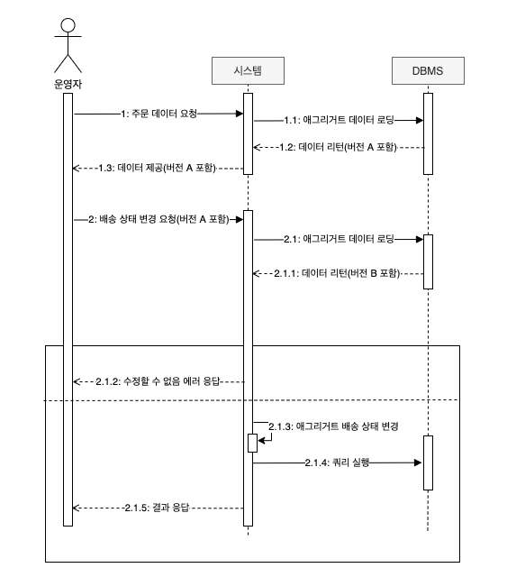

# 애그리거트 트랜잭션 관리


--- 



 - 과정 2에서 배송 상태 변경을 요청할 때 앞서 과정 1을 통해 받은 애그리거트 버전 값을 함께 전송한다.
 - 시스템은 애그리거트 조회시 버전 값도 함께 읽어오고 만약 과정 1에서 받은 버전 A와 과정 2.1을 통해 읽은 애그리거트 버전 B가 다르면 과정 1과 2 사이 다른 사용자가 해당 애그리거트를 수정한게 된다.
 - 이 경우 시스템은 운영자가 이전 데이터를 기준으로 작업을 요청한 것으로 간주해 수정할 수 없단 에러를 응답하게 된다.

 - 만약 버전 A와 B가 같다면 애그리거트를 수정하지 않은 것이 되고 2.1.3과 같이 애그리거트를 수정하고 2.1.4를 통해 변경 내용을 DBMS에 반영한다. 이후 성공 결과를 응답한다.
 - 만일 2.1.1과 2.1.4 사이 다른 사용자에 의해 애그리거트 수정이 일어날 경우 버전 값이 증가한 상태가 되므로 에러를 반환하게 된다.
 - 이처럼 비선점 잠금 방식을 여러 트랜잭션으로 확장할시 애그리거트 정보를 뷰로 보여줄 때 버전 정보도 사용자 화면에 전달해야 한다.
 - form과 input 태그를 사용한다면 hidden 타입을 통해 버전 값이 서버에 함께 전달 되도록 구성해야 한다.

```html
<input type="hidden" name="version" th:value = "${OrderDto.version}">
```

 - 응용 서비스에 전달할 요청 데이터는 사용자가 전송한 버전 값을 포함한다.
   - 배송 상태 변경을 처리하는 응용 서비스가 전달 받는 데이터는 주문 번호화 함께 주문을 조회한 시점의 버전 값을 포함해야 한다.

 
 - 응용 서비스는 전달 받은 버전을 통해 애그리거트 버전과 일치하는지 확인하고 일치 하는 경우에만 기능을 수행한다.
   - 변경 상태 불 일치는 Exception을 발생시켜 표현 계층에 이를 알려야 하고 버전 충돌을 사용자에게 알려 사용자가 알맞는 후속 처리를 할 수 있게 구성해야 한다.

 - 위 상황에서 사용하는 Exception을 확인하면 OptimisticLockingFailureException, VersionConflictException이다.
   - OptimisticLockingFailureException은 스프링 프레임 워크가 발생 시키며 VersionConflictException은 응용 서비스 코드에서 발생시키므로 발생한 시점을 구분할 수 있다.
   - VersionConflictException은 애그리서트를 수정했다는 것을 의미하며, OptimisticLockingFailureException은 누군가가 거의 동시에 애그거트를 수정했다는 것을 의미한다.
 - 버전 충돌 상황에 대한 구분이 명시적으로 필요하지 않다면 응용서비스에서 OptimisticLockingFailureException을 발생 시키는 것도 고려할 수 있다.

 - 이는 비선점 방식을 통한 트랜잭션 관리기 때문에 명확한 예외 발생과 처리가 필요하다.
