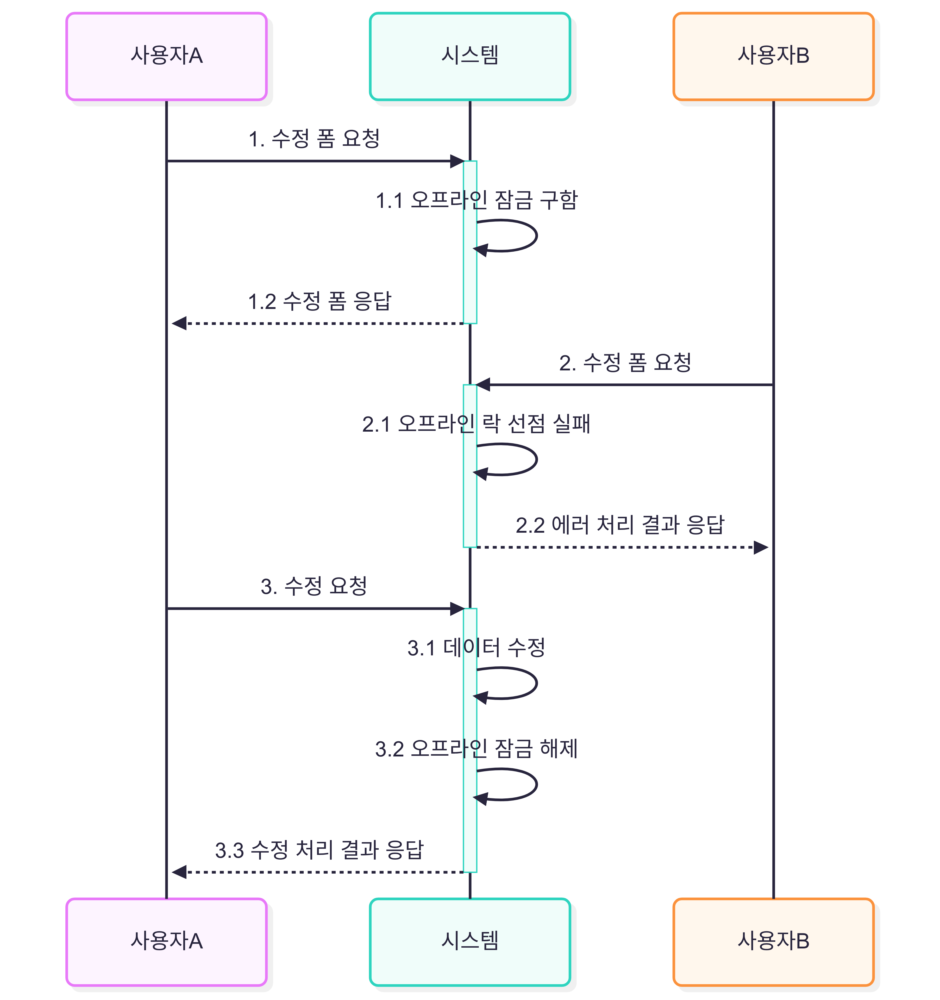

## 8.3.1 강제 버전 증가

애그리거트에 애그리거트 루트 외에 다른 엔티티가 변경될 경우, JPA는 버전을 증가시키지 않습니다.  
연관된 엔티티의 값이 변경되더라도 루트의 값이 바뀌지 않기 때문입니다.  

하지만 애그리거트 관점에서는 문제가 됩니다.  
애그리거트 구성 요소가 변경되면 논리적으로 그 애그리거트는 변경된 것이기 때문입니다.  

JPA는 이를 해결하기 위해 **강제로 버전 값을 증가시키는 잠금 모드**를 지원합니다.

```java
entityManager.find(Order.class, id, LockModeType.OPTIMISTIC_FORCE_INCREMENT);
```

이 모드를 사용하면 엔티티 상태가 실제로 변경되지 않았더라도, 트랜잭션 종료 시점에 **버전 값이 증가**합니다.


# 8.4 오프라인 선점 잠금

### 필요성

문서를 편집할 때 누군가가 이미 편집 중이면, 다른 사용자가 해당 문서를 수정할 수 없도록 제한할 필요가 있습니다.
예를 들어, 동시 수정은 가능하지만 "다른 사용자가 수정 중입니다."라는 경고를 보여주는 경우가 이에 해당합니다.

>단일 트랜잭션 내에서 동시 변경을 막는 선점 잠금이나 비선점 잠금만으로는 이 문제를 해결할 수 없습니다.

오프라인 선점 잠금은  **여러 트랜잭션에 걸쳐 동시 변경을 막는 방식**입니다.

- 첫 번째 트랜잭션이 시작될 때 잠금을 선점
- 마지막 트랜잭션에서 잠금을 해제



여기서 사용자 A가 3번과정을 거치지않고 프로그램을 종료했을땐 사용자B는 영원히 락을 획득하지 못하게 된다
이런 사태를 방지하기 위해 오프라인 선점방식은 잠금유효시간을 가져야한다.

유효시간이 지나면 자동으로 잠금을 해제해서 다른사용자가 잠금을 일정시간후에 구할수 있도록 해야한다.

사용자A가 유효시간이 지난 1초뒤에 3번을 요청했을땐 잠금이 해제되어 수정을 못하는 상황이있을수 있다 

이럴땐 Ajax를 호출해서 유효시간을 1분씩 늘려주는 방법이 필요하다.

## 8.4.1 LockManeger 인터페이스와 관련클래스

오프라인 선점 잠금의 필요 기능

1. 잠금 선점 시도 (`tryLock`)  
2. 잠금 확인 (`checkLock`)  
3. 잠금 해제 (`releaseLock`)  
4. 잠금 유효 시간 연장 (`extendLockExpiration`)

```java
public interface LockManager{
    LockId tryLock(String type, String id) throw LockException;
    
    void checkLock(LockId lockId) throw LockException;
    
    void releaseLock(LockId lockId) throw LockException;
    
    void extendLockExpiration(LockId lockId, Long inc) throw LockException;
}
```
tryLock은  각 잠금마다 고유 식별자를 갖도록 구현하고 잠금을 식별할때 사용할 LockId를 리턴하여

잠금을 구하면 잠금을 해제,유효성검사,유효시간 증가 할때 사용한다.
따라서 LockId가 없으면 잠금을 해제 할수 없으니 어딘가에 보관해야한다.

**오프라인 선점 잠금 기능을 이용해 데이터 수정폼에 접근하는 것을 제어하는 코드**
```java
// 서비스: 서비스는 잠금 ID를 리턴한다.
public DataAndLockId getDataWithLock(Long id) {
    // 1. 오프라인 선점 잠금 시도
    LockId lockId = lockManager.tryLock("data", id);

    // 2. 기능 실행
    Data data = someDao.select(id);
    return new DataAndLockId(data, lockId);
}

// 컨트롤러: 서비스가 리턴한 잠금 ID를 모델로 뷰에 전달한다.
@RequestMapping("/some/edit/{id}")
public String editForm(@PathVariable("id") Long id, ModelMap model) {
    DataAndLockId dl = dataService.getDataWithLock(id);
    model.addAttribute("data", dl.getData());

    // 3. 잠금 해제에 사용할 LockId를 모델에 추가
    model.addAttribute("lockId", dl.getLockId());

    return "editForm";
}
```
수정폼에서 데이터를 전송할때 LockId를 전송할수 있도록 모델에 추가

```java
// 서비스: 잠금을 해제한다.
public void edit(EditRequest editReq, LockId lockId) {
    // 1. 잠금 선점 확인
    lockManager.checkLock(lockId);

    // 2. 기능 실행
    // (실제 로직 실행)

    // 3. 잠금 해제
    lockManager.releaseLock(lockId);
}

// 컨트롤러: 서비스를 호출할 때 잠금 ID를 함께 전달
@RequestMapping(value = "/some/edit/{id}", method = RequestMethod.POST)
public String edit(@PathVariable("id") Long id,
                   @ModelAttribute("editReq") EditRequest editReq,
                   @RequestParam("lid") String lockIdValue) {

    editReq.setId(id);
    someEditService.edit(editReq, new LockId(lockIdValue));
    model.addAttribute("data", data);

    return "editSuccess";
}
```
checkLock() 메서드를 가장 먼저 실행하는 이유는 잠금을 선점한 이후에 반드시 주어진 LockId를 갖는 잠금이 유효한지 확인해야 하기 때문이다.

- 잠금 유효 시간이 지났으면 이미 다른 사용자가 잠금을 선점

- 잠금을 선점하지 않은 사용자가 기능을 실행했다면 기능실행을 막아야 한다.

