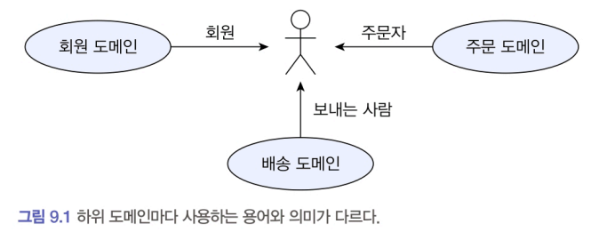
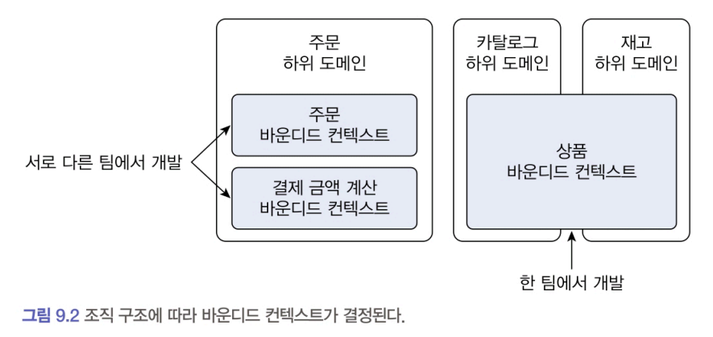
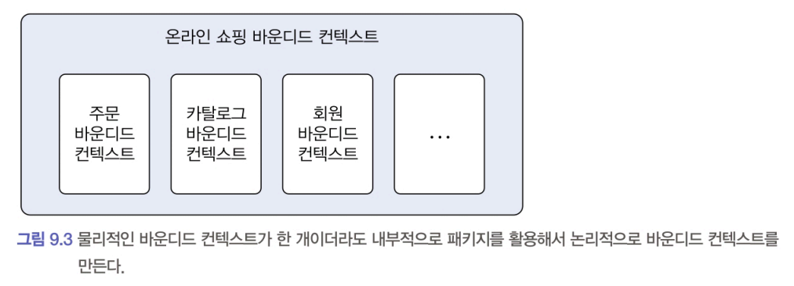

# 도메인 모델과 경계

#### 처음 도메인 모델을 만들 때 빠지기 쉬운 함정 
- 도메인을 완벽하게 표현하는 단일 모델을 만드는 시도를 하는 것

#### 반례
- 한 도메인은 다시 여러 하위 도메인으로 구분된다. 
- 즉, 한 개의 모델로 여러 하위 도메인을 모두 표현하려고 시도하면 오히려 모든 하위 도메인에 맞지 않는 모델을 만들게 된다.
    - 예를 들어 카탈로그에서 상품, 재고 관리에서 상품, 주문에서 상품, 배송에서 상품은 이름만 같지 실제로 의미하는 것이 다르다.
    - 논리적으로 같은 존재처럼 보이지만 하위 도메인에 따라 다른 용어를 사용하는 경우도 있다.
        - 시스템을 사용하는 사람을 회원 도메인에서는 회원이라고 부르지만, 주문 도메인에서는 주문자라고 부
르고, 배송 도메인에서는 보내는 사람이라고 부르기도 한다.
    

#### 정리
- 하위 도메인마다 같은 용어라도 의미가 다르다. 
- 또한 같은 대상이라도 지칭하는 용어가 다를 수 있다. 
- 때문에 한 개의 모델로 모든 하위 도메인을 표현하려는 시도는 올바른 방법이 아니며 표현할 수도 없다.

#### 해결방안
- 하위 도메인마다 사용하는 용어가 다르기 때문에 올바른 도메인 모델을 개발하려면 하위 도메인마다 모델을 만들어야 한다. 
    - 이 때, 각 모델은 명시적으로 구분되는 경계를 가져서 섞이지 않도록 해야 한다. 
    - 여러 하위 도메인의 모델이 섞이기 시작하면 모델의 의미가 약해진다. 
    - 여러 도메인의 모델이 서로 얽히기 때문에 각 하위 도메인별로 다르게 발전하는 요구사항을 모델에 반영하기 어려워진다.
- 모델은 특정한 컨텍스트(문맥) 하에서 완전한 의미를 갖는다. 
    - 같은 제품이라도 카탈로그 컨텍스트와 재고 컨텍스트에서 의미가 서로 다르다. 
    - 이렇게 구분되는 경계를 갖는 컨텍스트를 DDD에서는 바운디드 컨텍스트Bounded Context 라고 부른다.

---
# 바운디드 컨텍스트

- 바운디드 컨텍스트는 모델의 경계를 결정한다. 
    - 한 개의 바운디드 컨텍스트는 논리적으로 한 개의 모델을 갖는다.
- 바운디드 컨텍스트는 용어를 기준으로 구분한다. 
    - 카탈로그 컨텍스트와 재고 컨텍스트는 서로 다른 용어를 사용하므로, 이 용어를 기준으로 컨텍스트를 분리할 수 있다. 
- 또한 바운디드 컨텍스트는 실제로 사용자에게 기능을 제공하는 물리적 시스템이다. 
    - 도메인 모델은 이 바운디드 컨텍스트 안에서 도메인을 구현한다.

#### 현실
- 이상적으로 하위 도메인과 바운디드 컨텍스트가 일대일 관계를 가지면 좋겠지만 현실은 그렇지 않을 때가 많다.

- 바운디드 컨텍스트는 기업의 팀 조직 구조에 따라 결정되기도 한다. 
    - 주문 하위 도메인이라도 주문을 처리하는 팀과 복잡한 결제 금액 계산 로직을 구현하는 팀이 따로 있는 경우 
        - 주문 하위 도메인에 주문 바운디드 컨텍스트와 결제 금액 계산 바운디드 컨텍스트가 존재하게 된다. 
    - 용어를 명확하게 구분하지 못해 두 하위 도메인을 하나의 바운디드 컨텍스트에서 구현하는 경우 
        - 카탈로그와 재고 관리가 아직 명확하게 구분되지 않은 경우 두 하위 도메인을 하나의 바운디드 컨텍스트에서 구현하기도 한다.

- 규모가 작은 기업은 전체 시스템을 한 개 팀에서 구현할 때도 있다.

#### 여러 하위 도메인을 하나의 바운디드 컨텍스트에서 개발할 때 주의할 점

- 하위 도메인의 모델이 섞이지 않도록 한다. 
    - 한 프로젝트에 각 하위 도메인의 모델이 위치하면 전체 하위 도메인을 위한 단일 모델을 만들고 싶은 유혹에 빠지기 쉽다. 
        - 이 경우 도메인 모델이 개별 하위 도메인을 제대로 반영하지 못해 하위 도메인별로 기능을 확장하기 어렵게 되고 이는 서비스 경쟁력을 떨어뜨린다. 
- 한 개의 바운디드 컨텍스트가 여러 하위 도메인을 포함하더라도 하위 도메인마다 구분되는 패키지를 갖도록 구현한다. 
    - 하위 도메인을 위한 모델이 서로 뒤섞이지 않고 하위 도메인마다 바운디드 컨텍스트를 갖는 효과를 낼 수 있다.

#### 도메인 모델의 경계
- 바운디드 컨텍스트는 도메인 모델을 구분하는 경계가 된다. 
- 바운디드 컨텍스트는 구현하는 하위 도메인에 알맞은 모델을 포함한다. 
    - 같은 사용자라 하더라도 주문 바운디드 컨텍스트와 회원 바운디드 컨텍스트가 갖는 모델이 달라진다. 
        - 회원의 Member는 애그리거트 루트이지만 주문의 Orderer는 밸류가 된다.
    - 같은 상품이라도 카탈로그 바운디드 컨텍스트의 Product와 재고 바운디드 컨텍스트의 Proudct는 각 컨텍스트에 맞는 모델을 갖는다. 
        - 카탈로그의 Proudct는 상품이 속할 Category와 연관을 갖지만 재고의 Product는 카탈로그의 Category와 연관을 맺지 않는다.