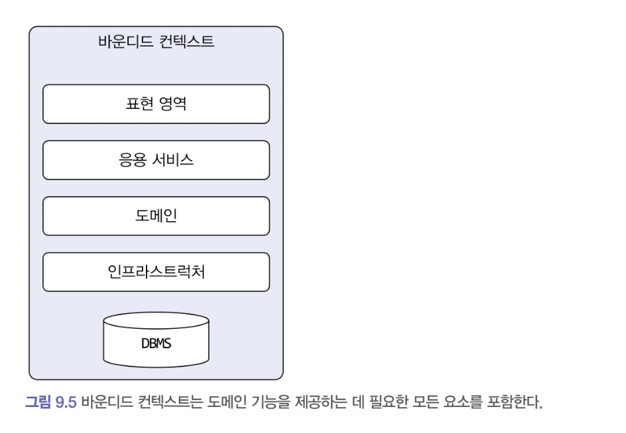
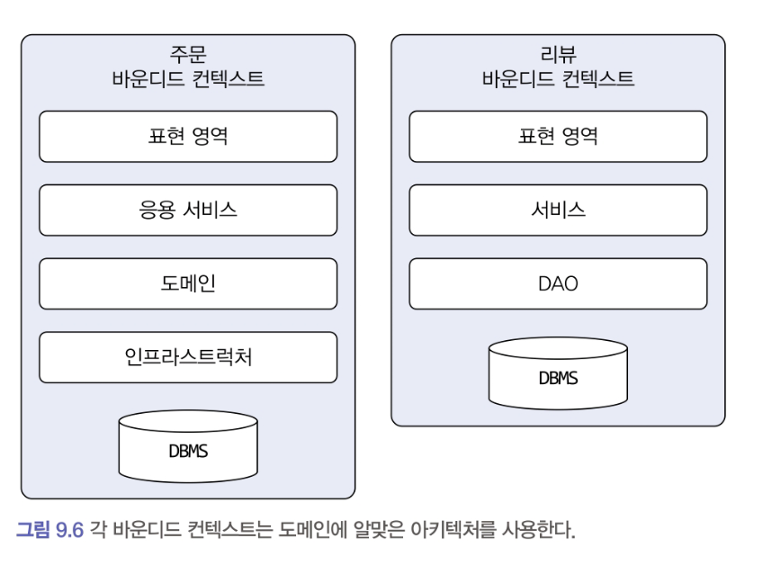
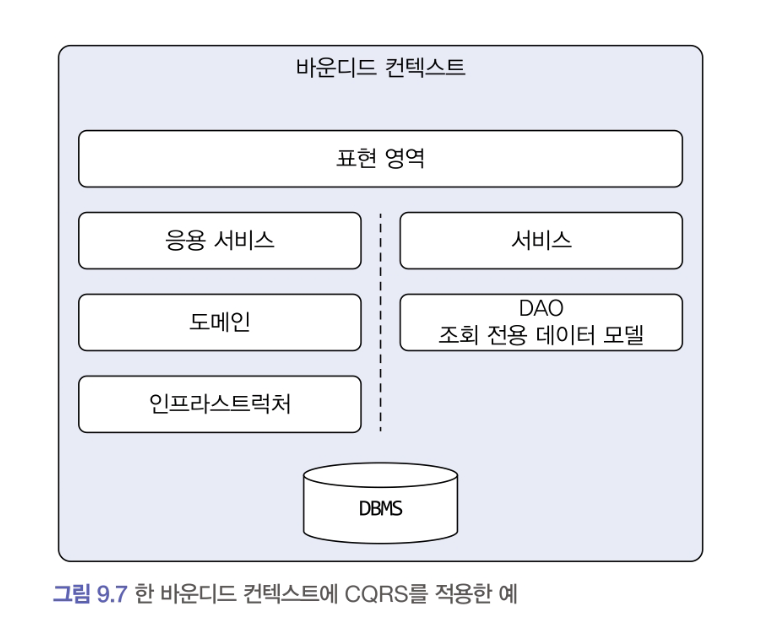
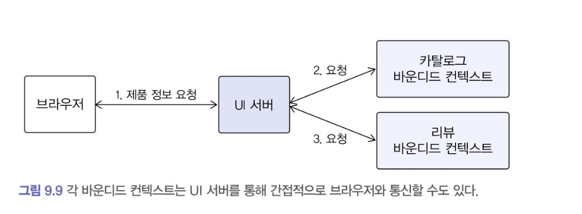

# 9.3 바운디드 컨텍스트 구현

바운디드 컨텍스트는 도메인 기능을 사용자에게 제공하는 데 필요한 표현 영역, 응용 서비스, 인프라스트럭쳐 영역을 모두 포함한다.
도메인 모델의 데이터 구조가 바뀌면 DB 테이블 스키마도 함께 변경해야 하므로 테이블도 바운디드 컨텍스트에 포함된다.

표현 영역은 유저를 위해 HTML 페이지를 생성할 수도 있고, 다른 바운디드 컨텍스트를 위해 REST API를 제공할 수도 있다.

---

모든 바운디드 컨텍스트를 반드시 도메인 주도로 개발할 필요는 없다.
상품의 리뷰는 복잡한 도메인 로직을 갖지않으므로 CRUD 방식으로 구현해도 된다. DAO와 데이터 중심의 밸류 객체를 이용해서 리뷰 기능을 구현해도 기능을 유지보수 하는데 큰 문제가 없다.
- 이 경우(서비스 - DAO 구조) 도메인 기능이 서비스에 흩어지게 되지만, 도메인 기능 자체가 단순하면 해당 방식을 사용해도 코드를 유지 보수하는데 문제되지 않는다.

한 바운디드 컨텍스트에서 두 방식을 혼합해서 사용할 수도 있다.
대표적인 예가 CQRS 패턴이다.
> CQRS (Command Query Responsibility Segregation)  
> 상태를 변경하는 명령 기능과 내용을 조회하는 쿼리 기능을 위한 모델을 구분하는 패턴

이 패턴을 단일 바운디드 컨텍스트에 적용하면 상태 변경과 관련된 기능은 도메인 모델 기반으로 구현하고, 조회 기능은 서비스-DAO를 이용해서 구현할 수 있다.

----

각 바운디드 컨텍스트는 서로 다른 구현 기술을 사용할 수도 있다.
- 스프링 MVC(웹 MVC) + JPA/하이버네이트
- Netty + MyBatis
- 몽고DB
- RDBMS

바운디드 컨텍스트가 반드시 사용자에게 보여지는 UI를 가지고 있어야 하는 것은 아니다.

웹 브라우저는 카탈로그 바운디드 컨텍스트를 통해 상세 정보를 읽어온 뒤, 리뷰 바운디드 컨텍스트의 REST API를 직접 호출해서 로딩한 JSON 데이터를 알맞게 가공해서 리뷰 목록을 보여줄 수도 있다.

UI를 처리하는 서버를 두고 UI 서버에서 바운디드 컨텍스트와 통신해서 사용자 요청을 처리하는 방법도 있다.
이 구조에서 UI서버는 각 바운디드 컨텍스트를 위한 파사드 역할을 수행한다. 브라우저가 UI서버에 요청을 보내면 UI서버는 카탈로그와 리뷰 바운디드 컨텍스트로부터 필요한 정보를 읽어와 조합 후 브라우저에 응답을 제공한다.