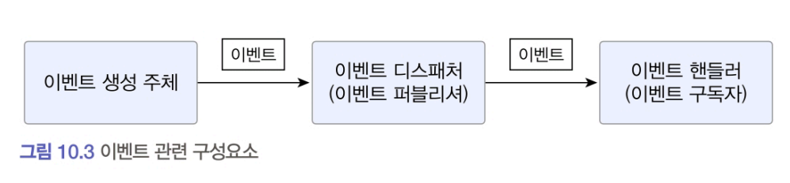

# 10.2 이벤트 개요

- 이벤트event 라는 용어는 '과거에 벌어진 어떤 것'을 의미한다.
    - 이벤트는 현재 기준으로 과거 (바로 직전이라도)에 벌어진 것을 표현하기 때문에 이름에 과거 시제를 사용한다.
- 이벤트가 발생한다는 것은 상태가 변경됐다는 것을 의미한다.
- 이벤트는 발생하는 것에서 끝나지 않는다. 
    - 이벤트 발생시 그 이벤트에 반응하여 원하는 동작을 수행하는 기능을 구현한다.
- 도메인 모델에서 도메인의 상태 변경을 이벤트로 표현할 수 있다.
    - '~할 때', '~가 발생하면', '만약 ~하면'과 같은 요구사항
        - 도메인의 상태 변경과 관련된 경우가 많다. 
    - 이 때, 이벤트를 이용해서 로직을 구현할 수 있다.

## 10.2.1 이벤트 관련 구성요소
- 도메인 모델에 이벤트를 도입하려면 네 개의 구성요소인 `이벤트`, `이벤트 생성 주체`, `이벤트 디스패처(퍼블리셔)`, `이벤트 핸들러(구독자)`를 구현해야 한다.

### 이벤트 생성 주체
- 도메인 모델에서 이벤트 생성 주체는 엔티티, 밸류, 도메인 서비스와 같은 도메인 객체이다. 
    - 도메인 객체는 도메인 로직을 실행해서 상태가 바뀌면 관련 이벤트를 발생시킨다.

### 이벤트 핸들러
- 이벤트 생성 주체가 발생한 이벤트에 반응한다. 
    - 생성 주체가 발생한 이벤트를 전달받아 이벤트에 담긴 데이터를 이용해서 원하는 기능을 실행한다.

### 이벤트 디스패처
- 이벤트 생성 주체와 이벤트 핸들러를 연결해 주는 것이 이벤트 디스패처dispatcher다.   
    - 이벤트 생성 주체는 이벤트를 생성해서 디스패처에 이벤트를 전달한다.    
    - 이벤트를 전달받은 디스패처는 해당 이벤트를 처리할 수 있는 핸들러에 이벤트를 전파한다. 
    - 이벤트 디스패처의 구현 방식에 따라 이벤트 생성과 처리를 동기나 비동기로 실행하게 된다.

## 10.2.2 이벤트의 구성
이벤트는 발생한 이벤트에 대한 정보를 담는다.
- 이벤트는 이벤트 핸들러가 작업을 수행하는 데 필요한 데이터를 담아야 한다. 
    - 데이터가 부족하면 핸들러는 필요한 데이터를 읽기 위해 관련 API를 호출하거나 DB에서 데이터를 직접
읽어와야 한다. 
- 이벤트는 데이터를 담아야 하지만 그렇다고 이벤트 자체와 관련 없는 데이터를 포함할 필요는 없다.

### 이벤트가 갖는 정보
- 이벤트 종류: 클래스 이름으로 이벤트 종류를 표현
- 이벤트 발생 시간
- 추가 데이터: 주문번호, 신규 배송지 정보 등 이벤트와 관련된 정보

