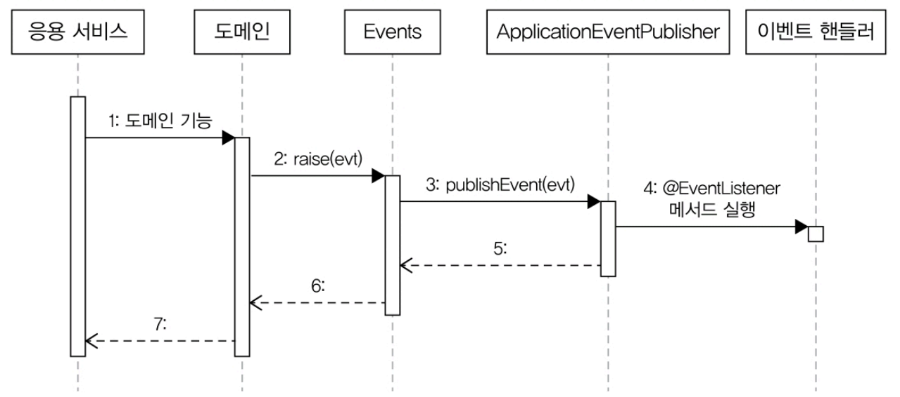

# 10.3 이벤트, 핸들러, 디스패처 구현

## 10.3.1 이벤트 클래스

## 10.3.2 Events 클래스와 ApplicationEventPublisher

### Events 클래스
```java
package com.myshop.common.event;

import org.springframework.context.ApplicationEventPublisher;

public class Events {
    private static ApplicationEventPublisher publisher;

    static void setPublisher(ApplicationEventPublisher publisher) {
        Events.publisher = publisher;
    }

    public static void raise(Object event) {
        if (publisher != null) {
            publisher.publishEvent(event);
        }
    }
}
```

### EventsConfiguration 클래스

Events#setPublisher() 메서드에 이벤트 퍼블리셔를 전달하기 위해 스프링 설정 클래스다.

```java
package com.myshop.common.event;

import org.springframework.beans.factory.InitializingBean;
import org.springframework.beans.factory.annotation.Autowired;
import org.springframework.context.ApplicationContext;
import org.springframework.context.annotation.Bean;
import org.springframework.context.annotation.Configuration;

@Configuration
public class EventsConfiguration {
    @Autowired
    private ApplicationContext applicationContext;

    @Bean
    public InitializingBean eventsInitializer() {
        return () -> Events.setPublisher(applicationContext);
    }
}
```

- eventsInitializer(): InitializingBean 타입 객체를 빈으로 설정한다. 
  - InitializingBean 타입: 스프링 빈 객체를 초기화할 때 사용하는 인터페이스
    - 이 기능을 사용해서 Events 클래스를 초기화
> - 참고: ApplicationContext는 ApplicationEventPublisher를 상속하고 있으므로 Events 클래스를 초기화할 때 ApplicationContext를 전달함.
>   ```java
>   package org.springframework.context;
>   
>   import org.springframework.beans.factory.HierarchicalBeanFactory;
>   import org.springframework.beans.factory.ListableBeanFactory;
>   import org.springframework.beans.factory.config.AutowireCapableBeanFactory;
>   import org.springframework.core.env.EnvironmentCapable;
>   import org.springframework.core.io.support.ResourcePatternResolver;
>   import org.springframework.lang.Nullable;
>   
>   public interface ApplicationContext extends EnvironmentCapable, ListableBeanFactory, HierarchicalBeanFactory, MessageSource, ApplicationEventPublisher, ResourcePatternResolver {...}
>   
>   ```
## 10.3.3. 이벤트 발생과 이벤트 핸들러

### 이벤트 발생
도메인 로직 실행 후 이벤트를 발생시킬 때는 `Events.raise()`를 사용한다.

```java
public class Order {
    public void cancel() {
        verifyNotYetShipped();
        this.state = OrderState.CANCELED;
        Events.raise(new OrderCanceledEvent(number.getNumber()));
    }
}
```

1. `Order#cancel()` 로직 실행
2. 이후 `Events.raise()`로 `OrderCanceledEvent` 이벤트 발행

### 이벤트 핸들러

이벤트를 처리하기 위해 스프링이 제공하는 `@EventListener` 애너테이션을 사용한다.

```java
import org.springframework.context.event.EventListener;
import org.springframework.stereotype.Service;

@Service
public class OrderCanceledEventHandler {
    private RefundService refundService;

    public OrderCanceledEventHandler(RefundService refundService) {
        this.refundService = refundService;
    }

    @EventListener(OrderCanceledEvent.class)
    public void handle(OrderCanceledEvent event) {
        refundService.refund(event.getOrderNumber());
    }
}
```

> ApplicationEventPublisher#publishEvent() 실행 시, OrderCanceledEvent 타입 객체를 전달
> 
> ➡️ OrderCanceledEvent.class 값을 갖는 @EventListener 애너테이션을 붙인 메서드를 찾아 실행

- 위 코드는 OrderCanceledEventHandler의 handle() 메서드를 실행한다.

## 10.3.4. 흐름 정리

아래는 이벤트 발생 및 처리 과정을  시퀀스 다이어그램으로 정리한 것이다.

### 이벤트 처리 흐름



1. **도메인 기능 실행**
   * 예: `Order#cancel()` 호출
2. **이벤트 발생**
   * `Events.raise(event)`
3. **이벤트 발행(Publish)**
   * Events.raise()는 스프링이 제공하는 `ApplicationEventPublisher.publishEvent(event)` 이용
4. **이벤트 핸들러 실행**
   *  `ApplicationEventPublisher`는 `@EventListener(이벤트타입.class)`로 등록된 핸들러 탐색 및 실행

### 트랜잭션 범위

* 코드 흐름을 보면 응용 서비스와 동일한 트랜잭션 범위에서 이벤트 핸들러를 실행하고 있다.
  * `ApplicationEventPublisher.publishEvent()`는 기본적으로 동기 방식으로 동작한다.
* 즉, 도메인 상태 변경과 이벤트 핸들러는 같은 트랜잭션 범위에서 실행된다.
