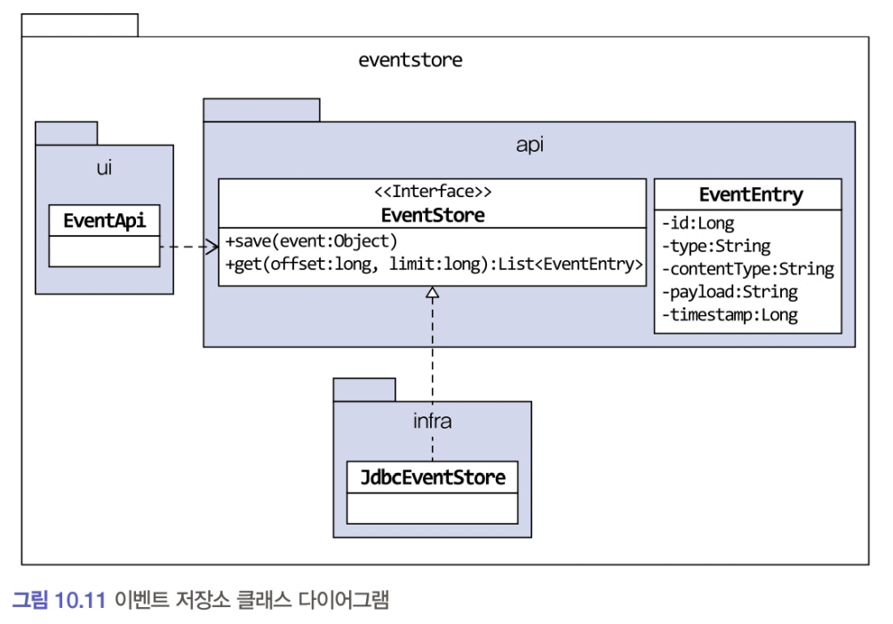

## 10.5.3 이벤트 저장소를 이용한 비동기 처리

### 이벤트 저장소 구현
- 포워더 방식과 API 방식 모두 이벤트 저장소를 사용



- EventEntry: 이벤트 저장소에 보관할 데이터
    - EventEntry는 이벤트를 식별하기 위한 id, 이벤트 타입인 type, 직렬화한 데이터 형식인 contentType, 이벤트 데이터 자체인 payload, 이벤트 시간인 timestamp를 갖는다.
- EventStore: 이벤트를 저장하고 조회하는 인터페이스를 제공
- JdbcEventStore: JDBC를 이용한 EventStore 구현 클래스
- EventApi: REST API를 이용해서 이벤트 목록을 제공하는 컨트롤러

#### EventEntry 클래스

```java
public class EventEntry {
    private Long id;
    private String type;
    private String contentType;
    private String payload;
    private long timestamp;

    public EventEntry(String type, String contentType, String payload) {
        this.type = type;
        this.contentType = contentTypе;
        this.payload = payload;
        this.timestamp = System.currentTimeMillis();
    }

    public EventEntry(Long id, String type, String contentType, String payload, long timestamp) {
        this.id = id;
        this.type = type;
        this.contentType = contentType;
        this.payload = payload;
        this.timestamp = timestamp;
    }

    public Long getId() {
        return id;
    }
    public String getType() {
        return type;
    }
    public String getContentType() {
        return contentType;
    }
    public String getPayload() {
        return payload;
    }
    public long getTimestamp() {
        return timestamp;
    }
}
```
- EventStore는 이벤트 객체를 직렬화해서 payload에 저장한다. 
    - 이 때 JSON으로 직렬화했다면 contentType 값으로 'application/json'을 갖는다.

#### EventStore 인터페이스
```java
public interface EventStore {
    
    void save(Object event);
    
    List<EventEntry> get(long offset, long limit);
}
```
- 이벤트는 과거에 벌어진 사건이므로 데이터가 변경되지 않는다. 
    - 그러므로 EventStore 인터페이스는 새로운 이벤트를 추가하는 기능과 조회하는 기능만 제공한다. 
    - 기존 이벤트 데이터를 수정하는 기능은 제공하지 않는다.

#### EventStore 인터페이스를 구현한 JdbcEventStore 클래스
```java
@Component
public class JdbcEventStore implements EventStore {
    
    private ObjectMapper objectMapper;
    private JdbcTemplate jdbcTemplate;

    public JdbcEventStore(ObjectMapper objectMapper, JdbcTemplate jdbcTemplate) {
        this.objectMapper = objectMapper;
        this.jdbcTemplate = jdbcTemplate;
    }

    @0verride 
    public void save(Object event) {
        
        EventEntry entry = new EventEntry(event.getClass().getName(), 
        "application/json", toJson(event));
        
        jdbcTemplate.update(
            "insert into evententry " +
            "(type, content_type, payload, timestamp) " +
            "values (?, ?, ?, ?)",
            ps -> {
                ps.setString(1, entry.getType());
                ps.setString(2, entry.getContentType());
                ps.setString(3, entry.getPayload());
                ps.setTimestamp(4, new Timestamp(entry.getTimestamp()));
            });
    }

    private String toJson(Object event) {    
        try {
            return objectMapper.writeValueAsString(event);
        } catch (JsonProcessingException e) {
            throw new PayloadConvertException(e);
    }
    
    @Override
    public List<EventEntry> get(long offset, long limit) {
        
        return jdbcTemplate.query(
            "select * from evententry order by id asc limit ?, ?",
            ps -> {
                ps.setLong(1, offset);
                ps.setLong(2, limit);
                },
            (rs, rowNum) -> {
                return new EventEntry(
                    rs.getLong("id"),
                    rs.getString("type"),
                    rs.getString("content_type"),
                    rs.getString("payload"),
                    rs.getTimestamp("timestamp").getTime());
            });
    }
}
```
- 스프링이 제공하는 JdbcTemplate을 사용하여 간단히 구현

#### evententry 테이블 DDL
```sql
create table evententry (
    id int not null AUTO_INCREMENT PRIMARY KEY,
    `type` varchar (255),
    `content_type` varchar (255),
    payload MEDIUMTEXT,
    `timestamp` datetime
) character set utf8mb4;
```

### 이벤트 저장을 위한 이벤트 핸들러 구현
- 핸들러를 통 발생한 이벤트를 이벤트 저장소에 추가한다

```java
@Component
public class EventStoreHandler {
    private EventStore eventStore;
    
    public EventStoreHandler (EventStore eventStore) {
        this.eventStore = eventStore;
    }
    
    @EventListener (Event.class)
    public void handle (Event event) {
        eventStore.save(event);
    }
}
```


### REST API 구현
- offset과 limit의 웹 요청 파라미터를 이용해서 EventStore#get을 실행하고 그 결과를 JSON으로 리턴한다.

```java
@RestController
public class EventApi {
    
    private EventStore eventStore;
    
    public EventApi (EventStore eventStore) {
        this.eventStore = eventStore;
    }

    @GetMapping("/api/events")
    public List<EventEntry> list(
        @RequestParam("offset") Long offset, @RequestParam("limit") Long limit) {
            return eventStore.get(offset, limit);
    }
}
```
- 스프링 MVC의 컨트롤러를 이용해서 REST API를 구현한 예
