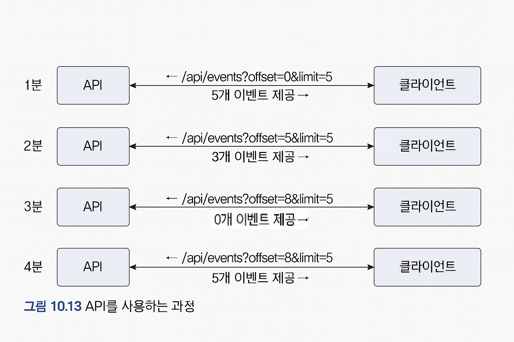

# 이벤트 저장소를 이용한 비동기 처리
EventApi가 제공하는 REST API를 사용하는 클라이언트는 다음 과정을 실행한다.




클라이언트 API를 이용하면 언제든지 원하는 이벤트를 가져올 수 있기 때문에 이벤트 처리에 실패해도 다시 실패한 이벤트부터 읽어와 재처리할 수 있습니다.  
또한 API 서버에 장애가 발생한 경우에도 주기적으로 재시도하여 서버가 복구되면 이벤트를 처리할 수 있습니다.

---

## 포워더(Event Forwarder) 구현

포워더는 API 방식의 클라이언트 구현과 유사합니다.  
일정 주기로 EventStore에서 이벤트를 읽어와 이벤트 핸들러에 전달하면 됩니다.

### EventForwarder 예제 코드

```java
public class EventForwarder {
    private static final int DEFAULT_LIMIT_SIZE = 100;

    @Scheduled(initialDelay = 1000L, fixedDelay = 1000L)
    public void getAndSend() {
        long nextOffset = getNextOffset(); // 읽어올 이벤트의 다음 Offset
        List<EventEntry> events = eventStore.get(nextOffset, DEFAULT_LIMIT_SIZE);

        if(!events.isEmpty()){
            int processedCount = sendEvent(events);
            if (processedCount > 0) {
                saveNextOffset(nextOffset + processedCount);
            }
        }
    }

    private long getNextOffset() {
        return offsetStore.get();
    }

    private int sendEvent(List<EventEntry> events) {
        int processedCount = 0;
        try {
            for (EventEntry event : events) {
                eventStore.send(event);
                processedCount++;
            }
        } catch (Exception ex) {
            // 로깅 처리
        }
        return processedCount;
    }

    private void saveNextOffset(long nextOffset) {
        offsetStore.update(nextOffset);
    }
}
```

---

### 설명

- `sendEvent()` 메서드는 파라미터로 전달받은 이벤트를 차례대로 발송합니다.  
- 전송 도중 예외가 발생하면 이벤트 전송을 멈추고, 전송에 성공한 이벤트 개수를 반환합니다.  
- `saveNextOffset()` 메서드에서는 최종적으로 전송에 성공한 이벤트 기준으로 다음 이벤트의 offset을 저장합니다.  
- 다음 번 `getAndSend()` 실행 시, 마지막으로 전송에 성공한 이벤트의 다음 이벤트부터 읽어와 전송을 시도합니다.

---

## OffsetStore 인터페이스

```java
public interface OffsetStore {
    long get();
    void update(long nextOffset);
}
```

- 구현체는 offset 값을 DB나 물리적 저장소에 저장하여 관리합니다.

---

## EventSender 인터페이스

```java
public interface EventSender {
    void send(EventEntry event);
}
```

- 구현체는 `send()` 메서드에서 외부 메시징 시스템에 이벤트를 전송하거나 원하는 이벤트를 처리합니다.  
- 이벤트 처리 중 예외가 발생하면 그대로 전파하여, 다음 주기에 `getAndSend()`가 재처리할 수 있도록 합니다.

---