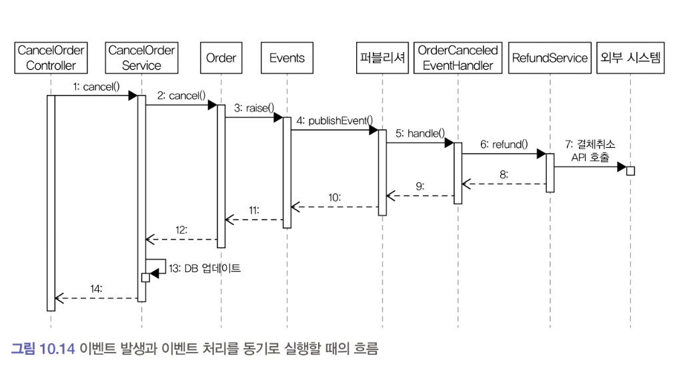
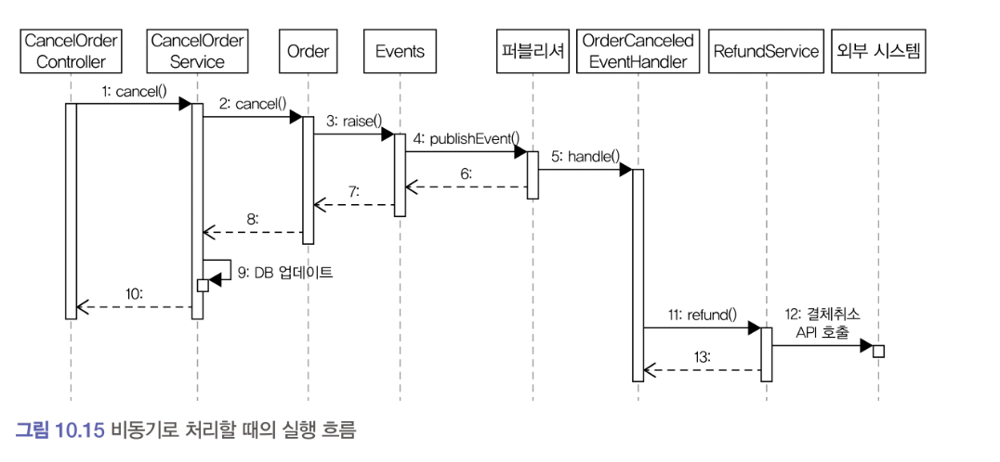

# 10.6 이벤트 적용 시 추가 고려 사항

## 이벤트를 구현할 때 추가로 고려할 점

1. 이벤트 소스를 EventEntry에 추가할지의 여부
    - 앞서 구현한 EventEntry는 이벤트 발생 주체에 대한 정보를 갖지 않는다.
    - 따라서 'Order가 발생한 이벤트만 조회하기' 와 같이 특정 주체가 발생시킨 이벤트만 조회하는 기능은 구현할 수 없다.
    - 이 기능을 구현하려면 이벤트에 발생 주체 정보를 추가해야 한다.

2. 포워더에서 전송 실패를 얼마나 허용할 것인지에 대한 것
    - 포워더는 이벤트 전송 실패시 실패한 이벤트부터 다시 읽어와 전송을 시도한다.
    - 특정 이벤트에서 계속 전송 실패 시 해당 이벤트 때문에 이후 이벤트를 전송할 수 없게 된다.
    - 따라서 포워더 구현 시에는 실패한 이벤트의 재전송 횟수 제한을 두어야 한다.
        - 예를 들어 동일 이벤트를 전송하는 데 3회 실패했다면 해당 이벤트는 생략하고 넘어가는 정책이 필요하다 (dlq)
> 처리에 실패한 이벤트를 생략하지 않고 별도 실패용 DB나 메시지 큐에 저장하기도 한다. <br>
> 처리에 실패한 이벤트를 물리적인 저장소에 남겨두면 이후 실패 이유 분석이나 후처리에 도움이 된다.

3. 이벤트 손실에 대한 것 (outbox)
    - 이벤트 저장소를 사용하는 방식은 이벤트 발생과 이벤트 저장을 한 트랜잭션으로 처리한다.
        - 때문에 트랜잭션에 성공 시, 이벤트가 저장소에 보관된다는 것을 보장할 수 있다.
        - 반면, 로컬 핸들러를 이용해서 이벤트를 비동기로 처리 할 경우 이벤트 처리에 실패 시 이벤트를 유실하게 된다.
4. 이벤트 순서에 대한 것
    - 이벤트 발생 순서대로 외부 시스템에 전달해야 할 경우, 이벤트 저장소를 사용하는 것이 좋다.
        - 이벤트 저장소는 저장소에 이벤트를 발생 순서대로 저장하고 그 순서대로 이벤트 목록을 제공하기 때문이다. (주문 - 결제 - 배송 등, 커밋 이후 새로운 트랜잭션이 생성-커밋되는 구조)
        - 반면 메시징 시스템은 사용 기술에 따라 이벤트 발생 순서와 메시지 전달 순서가 다를 수도 있다. (동일 키 사용 이유)

5. 이벤트 재처리에 대한 것
    - 동일 이벤트를 다시 처리해야 할 경우 해당 이벤트를 어떻게 할지 결정해야 한다.
        - 마지막으로 처리한 이벤트의 순번을 기억해 두었다가 이미 처리한 순번의 이벤트가 도착하면 해당 이벤트를 처리하지 않고 무시하는 방법이 가장 쉽다.
            - 회원 가입 신청 이벤트 처음 도착시에는 이메일 발송, 동일한 순번의 이벤트가 다시 들어오면 이메일을 발송하지 않는 방식으로 구현
        - 멱등으로 처리하는 방법
   > 멱등성 : 연산을 여러번 적용해도 결과가 달라지지 않는 성질
   >- ex) Math.abs() 는 모두 결과가 같다.<br>
      >이벤트 처리도 동일 이벤트를 여러번 처리했을 시에도 시스템이 같은 상태가 되도록 핸들러를 구현할 수 있다.
   >- 배송지 정보 변경 이벤트를 받아서 주소를 변경하는 핸들러는 그 이벤트를 여러번 처리해도 결과적으로 동일 주소를 값으로 갖는다. 해당 이벤트 핸들러는 멱등성을 갖는다.
   >- 이벤트 핸들러가 멱등성을 가지면 시스템 장애로 동일 이벤트 중복 발생시에도 결과적으로 동일 상태가 되므로 이벤트 중복 발생이나 중복 처리에 대한 부담을 줄여준다.

### 10.6.1 이벤트 처리와 DB 트랜잭션 고려
#### DB 트랜잭션 관점에서 고려할 점
- 이벤트 처리 시에는 DB 트랜잭션을 함께 고려해야 한다.
- 주문 취소와 환불 기능을 이벤트를 이용해서 구현한 경우
    - 주문 취소 기능은 주문 취소 이벤트를 발생시킨다.
    - 주문 취소 이벤트 핸들러는 환불 처리를 요청한다.
    - 환불 서비스는 외부 api를 호출해서 결제를 취소한다.
- 이벤트 발생과 처리를 모두 동기로 처리하면 실행 흐름은 다음과 같다.



> 위와 같은 실행 흐름에서 12번 과정까지 다 성공 후에 DB 업데이트 실패시, 결제는 취소되었는데 DB에는 주문이 취소되지 않은 상태로 남게된다.

- 이벤트를 비동기로 처리할 때에도 DB 트랜잭션을 고려해야한다.



>위는 주문 취소 이벤트를 비동기로 처리할 때의 실행 흐름이다. <br>
>이벤트 핸들러를 호출하는 5번 과정은 비동기로 실행한다.
>DB 업데이터와 트랜잭션 커밋 후 환불로직인 11~13번 과정 실행시, 12번 과정에서 외부 api 호출에 실패하면 DB에는 주문 취소된 상태로 데이터가 바뀌었는데, 결제는 취소되지 않은 상태로 남게된다.

- 이벤트 처리를 동기로 하든 비동기로 하든 이벤트 처리 실패와 트랜잭션 실패를 함께 고려해야 한다.
    - 둘을 모두 고려하면 복잡해지므로, 경우의 수를 줄이면 도움이 된다. 예를 들면 트랜잭션이 성공할 때만 이벤트 핸들러를 실행하는 것이다.

- 스프링은 @transactionalEventListener 애너테이션을 지원한다. 이 애너테이션은 스프링 트랜잭션 상태에 따라 이벤트 핸들러를 실행할 수 있게 한다.

```java
@TransactionalEventListener(
    classes = OrderCanceledEvent.class,
    phase = TransactionPhase.AFTER_COMMIT
)
public void handle(OrderCanceledEvent event) {
    refundService.refund(event.getOrderNumber());
}
```

위 코드에서 phase 속성 값으로 `TransactionPhase.AFTER_COMMIT` 을 지정했다. 이 값을 사용하면 스프링은 트랜잭션 커밋 성공 후 핸들러 메서드를 실행한다. 중간에 에러가 발생해서 트랜잭션이 롤백 되면 핸들러 메서드를 실행하지 않는다. 때문에 이벤트 핸들러 실행했는데 트랜잭션이 롤백되는 상황은 발생하지 않는다.

이벤트 저장소로 DB를 사용해도 동일한 효과를 볼 수 있다. 이벤트 발생 코드와 이벤트 저장 처리를 한 트랜잭션으로 처리하면 된다. 이렇게 하면 트랜잭션이 성공할 때만 이벤트가 DB에 저장되므로, 동일하게 처리할 수 있다.

트랜잭션 성공 시에만 이벤트 핸들러를 실행하게 되면 트랜잭션 실패에 대한 경우의 수가 줄어 이벤트 처리 실패만 고민하면 된다.(보상 트랜잭션 등) 이벤트 특성에 따라 재처리 방식을 결정하면 된다.
