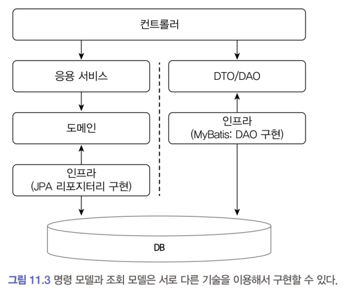

# 11. CQRS

# 11.1 단일 모델의 한계

주문 상세 내역 조회 기능을 구현하려면 여러 애그리거트에서 데이터를 함께 조회해야 한다. 예를 들어:

* **Order**: 주문 정보
* **Product**: 상품 이름
* **Member**: 회원 이름과 ID

조회 화면은 속도가 빠를수록 좋기 때문에, 이러한 다중 애그리거트 데이터 조합에서 성능 문제가 자주 발생한다.

## 문제점

1. 식별자 참조 방식의 제약
   * 3장에서 설명한 것처럼 애그리거트를 식별자로만 참조하면, JPA의 즉시 로딩(eager loading) 같은 쿼리 최적화 기능을 활용하기 어렵다.
   * 그 결과, 한 번의 `SELECT`로 화면에 필요한 데이터를 모두 가져오기 어려워 성능 저하가 발생한다.
2. **직접 참조 방식의 문제**
   * 애그리거트를 직접 참조하도록 변경하더라도 문제가 남는다.
   * 조회 화면마다 요구사항이 다르므로, 동일한 연관 관계도 **즉시 로딩**으로 처리할지, **지연 로딩**으로 처리할지 선택해야 한다.
   *  DBMS가 제공하는 전용 기능이 필요하면 JPA의 네이티브 쿼리를 사용해야 할 수도 있다.
3. **단일 모델 사용의 한계**
  * 현재 구조는 시스템 **상태 변경**과 **조회** 모두에서 단일 도메인 모델을 사용한다.
  * ORM 기반 도메인 모델은 `Order#cancel()`이나 `Order#changeShippingInfo()` 같은 **상태 변경 기능**에는 적합하다.
  * 반면, 주문 상세 조회처럼 여러 애그리거트에서 데이터를 모아 출력해야 하는 **조회 기능**에는 불필요하게 복잡해진다.

> 참고. CORS에 대한 내용을 영상으로도 정리했다. https://youtu.be/xf0kXMTFJm8 

# 11.2 CQRS

시스템이 제공하는 기능은 크게 두 가지로 나눌 수 있다.

1. **상태 변경 기능 (Command)**

   * 새로운 주문 생성
   * 배송지 정보 변경
   * 회원 암호 변경
   * 등과 같이 데이터를 **저장소에 변경**하는 기능

2. **상태 조회 기능 (Query)**

   * 주문 상세 내역 보기
   * 게시글 목록 보기
   * 회원 정보 보기
   * 판매 통계 보기
   * 등과 같이 데이터를 **읽어와 화면(UI)에 표시**하는 기능

## 문제 인식

* **명령 기능**은 주로 한 애그리거트의 상태를 변경한다.

    * 예: 주문 취소, 배송지 정보 변경 → `Order` 애그리거트 하나만 수정

* **조회 기능**은 여러 애그리거트의 조합이 필요한 경우가 많다.

    * 예: 주문 상세 조회 → `Order`, `Product`, `Member`를 함께 조회

* 이처럼 **상태 변경 범위와 상태 조회 범위가 일치하지 않기 때문에**, 단일 모델로 두 기능을 모두 처리하면 모델이 불필요하게 복잡해진다.

## CQRS: Command Query Responsibility Segregation

단일 모델을 사용할 때 발생하는 복잡도를 해결하기 위해 사용하는 방법이 바로 CQRS다.

* **CQRS**: *Command Query Responsibility Segregation*
* 상태 변경을 담당하는 **명령(Command) 모델**과
* 상태 조회를 담당하는 **조회(Query) 모델**을 

**분리**하는 패턴

## CQRS의 장점

1. **복잡한 도메인에 적합**

   * 도메인이 복잡할수록 명령과 조회가 다루는 데이터 범위가 다르다.
   * 두 기능을 단일 모델로 처리하면 조회 기능의 로딩 속도를 위해 모델 구현이 필요 이상으로 복잡해진다.
     * 예: 온라인 쇼핑몰에서 다양한 기준으로 주문/판매 통계를 조회해야 하는 경우
       * 통계 값을 빠르게 조회하기 위해 JPA와 관련된 다양한 성능 관련 기능을 모델에 적용 ➡️ 단일 모델(JPA)만으로는 성능 최적화가 어렵다.
   * CQRS는 조회 전용 모델을 별도로 두어 이러한 복잡성을 줄여준다.

2. **기술 선택의 유연성**

   * 명령 모델: 도메인 로직 중심이므로 **JPA**와 같은 ORM에 적합
   * 조회 모델: 단순 조회 중심이므로 **MyBatis**나 SQL 기반 접근에 적합
   * 상황에 따라 각 모델에 최적화된 기술을 선택할 수 있다.

## CQRS 구현 방식

* 조회 모델은 **응용 서비스가 없어도 무방**하다.

  * 단순히 데이터를 읽어오기만 하면 되므로, 컨트롤러에서 직접 DAO 호출 가능
    * 다만, 표현 계층으로 데이터를 전달하는 과정에서 부가 로직이 필요하다면 응용 서비스를 둘 수도 있다.

* 명령 모델과 조회 모델 설계 예:

  * 

  * **명령 모델**: 객체 지향 도메인 모델 기반, 상태 변경 로직 중심
  * **조회 모델**: 화면 표시용 데이터 구조 중심 (예: 주문 요약 목록 제공할 때 필요한 정보를 담고있는 DTO 이용)

→ 두 모델 모두 **주문**과 관련되어 있지만, 목적에 따라 설계 방향이 다르다.
